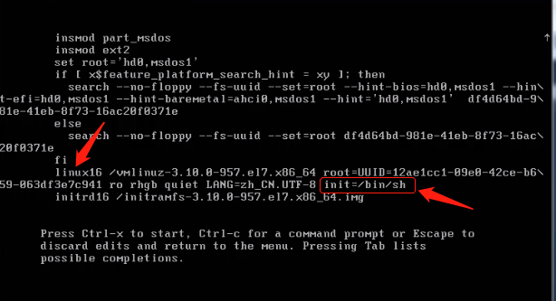
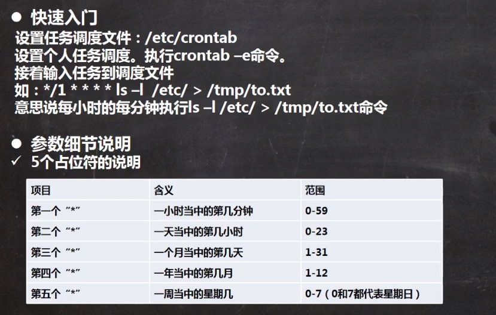
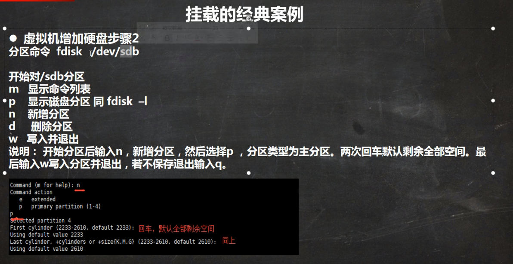
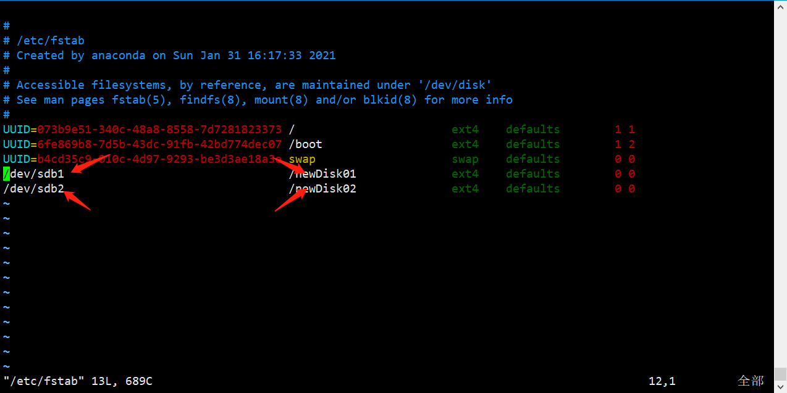
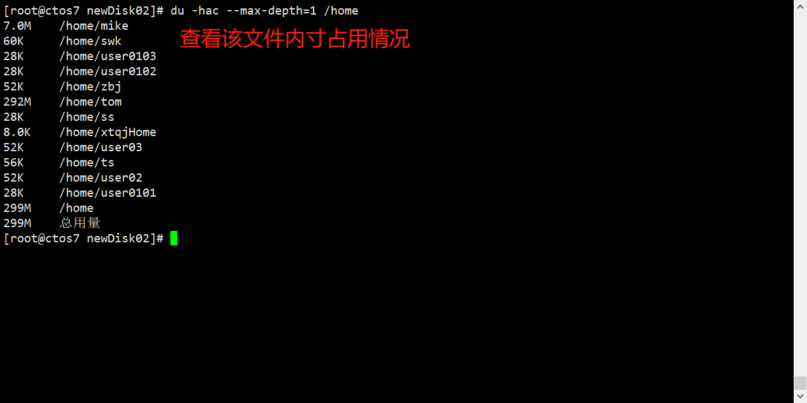
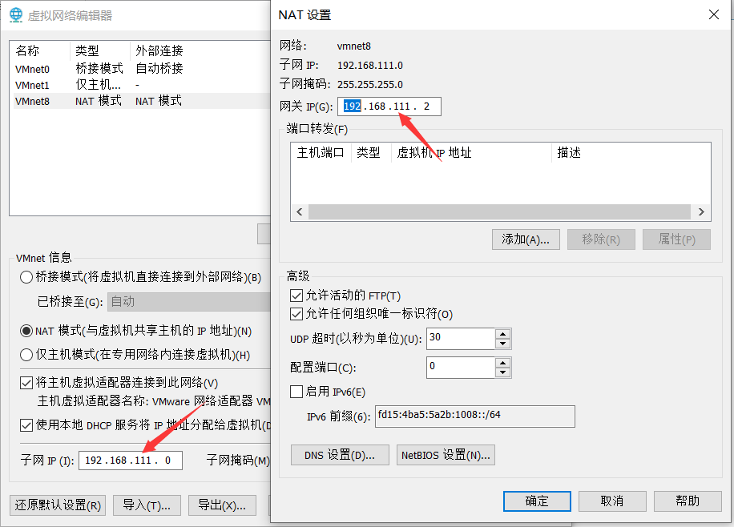
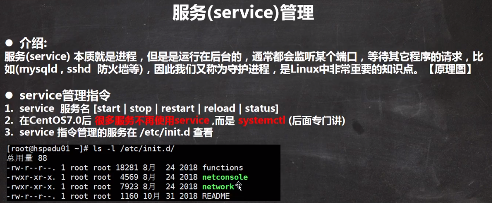

## 	常用命令

### **vi/vim编辑器：**

* `vim 文件名`：创建或打开一个文件
  * 三种模式：
    * 正常模式：	
      * 使用vim打开一个文档就直接进入一般模式
      * `yy`：复制（`5yy`：可以复制5行）、`p`：粘贴
      * `dd`：删除（`5dd`：可以删除5行）
      * `u`：撤销
      * `G`：定位到最后一行
      * `gg`：定位到第一行（`5gg`：定位到第5行）
    * 编辑模式：
      * 按下i、I、o、O、a、A、R等任意一个字母后进入编辑模式，编辑模式安Esc进入命令行模式
    * 命令行模式：
      * 在这个模式当中，可以提供你相关指令，完成读取、存盘、替换、离开vim、显示行号等的动作则是在此模式中达成的
      * `:set nu`：打开行号
      * `:set nonu`：关闭行号
      * `:wq`：保存并退出	
      * `:q`：退出
      * `:q!`：强制退出
      * `:数字`：定位到多少行
      * `\关键字`：查找某个字符，按`n`查找下一个
      * 关机或重启会自动使用`sync`同步数据，

### **关机重启**

* `shutdown -h now` 立该进行关机
* `shudown -h 1` 1分钟后会关机了
* `shutdown -r now` 现在重新启动计算机
* `halt`  关机
* `reboot` 重启
* `sync`  把内存的数据同步到磁盘.

### **用户登录或注销**

*  登录时尽量少用root帐号登录，因为它是系统管理员，最大的权限，避免操作失误。可以利用普通用户登录，登录后再用`su-用户名`命令来切换成系统管理员身份
* root用户切换到其他用户不需要任何操作
* 普通用户切换到其他用户需要使用密码登录
* 使用`exit`命令退出登录
* 在提示符下输入logout即可注销用户
* logout 注销指令在图形运行级别无效，在运行级别3下有效

### **用户管理**

* `useradd 用户名` 添加用户
* `userdel 用户名` 删除用户
* `userdel -r 用户名` 删除用户，并删除该用户的家目录
* `useradd -d 目录路径 用户名` 添加用户并指定该用户的家目录地址
* `passwd 用户名` 修改该用户的密码
* `id 用户名` 查看该用户的信息
* `su 用户名` 切换用户
* `whoami` 查看当前是那个用户登录
* `who am i`  查看当前是那个用户登录，并显示登录时间
* **用户组**
  * `groupadd 组名`  新增一个组
  * `groupdel 组名` 删除一个组 
  * `useradd -g 组名 用户名`添加用户并添加该用户到那个组内
  * `usermod -g 组名` 修改该用户的组信息
* 用户和组相关文件
  * /etc/passwd文件
    * 用户( user)的配置文件，记录用户的各种信息
    * 每行的含义∶用户名:口令:用户标识号:组标识号:注释性描述:主目录:登录Shell
  * /etc/shadow 文件
    * 口令的配置文件
    * 每行的含义:登录名:加密口令:最后一次修改时间:最小时间间隔:最大时间间隔:警告时间:不活动时间:失效时间:标志
  * /etc/group文件
    * 组(group)的配置文件，记录Linux包含的组的信息每行含义∶组名:口令:组标识号:组内用户列表

### **运行级别**

* 基本介绍
  * 0：关机
  * 1：单用户【找回丢失密码】
  * 2：多用户状态没有网络服务
  * 3：多用户状态有网络服务
  * 4：系统未使用保留给用户5:图形界面
  * 6：系统重启
  * 常用运行级别是3和5,也可以指定默认运行级别，后面演示
  * 命令:`init[0123456]`应用案例:通过`init`来切换不同的运行级别，比如动5-3，然后关机。

* 指定运行级别
  * CentOS7后运行级别说明
  * 在centos7以前,/etc/inittab文件中
  * 进行了简化，如下:
    * multi-user.target: analogous to runlevel 3
    * graphical.target: analogous to runlevel 5
    * `systemctl get-default` 查看当前气筒处于那个运行级别
    * `systemctl set-default xxx.target` 设置系统为那个运行级别

> **v找回root密码**

* 启动系统，进入开机界面是按`e`进入编辑界面
* 

* 在以下位置添加`init=/bin/sh`
* 

* 输入`ctrl+x`进入单用户模式
* 进入后执行一下操作
* 

* 等待重启后密码修改成功

### **帮助指令**

* man获得帮助信息
  * 基本语法:man命令或配置文件(功能描述:获得帮助信息)案例:查看ls命令的帮助信息
* help指令
  * 基本语法:help命令(功能描述∶获得shell内置命令的帮助信息)

### **文件目录**

* `pwd` 查看当前处于那个目录下
* `ls` 列出当前目录下的文件
  * `ls -a` 显示当前目录所有的文件和目录,包括隐藏的。
  * `ls -l` 以列表的方式显示信息
* `cd` 切换目录
  * `cd 目录路径` 切换到指定目录
  * `cd ..` 退回到上一级目录
  * `cd ~` 切换到该用户的家目录（直接使用`cd`不带参数也一样）
* `mkdir 目录名` 创建目录
  * `mkdir -p` 创建1多级目录
* `rmdir 目录名` 删除空目录
  * 如果要删除非空目录，必须使用`rm -rf 目录名`递归删除
* `touch 文件名`
  * 创建一个空文件
* `cp` 拷贝
  * `cp -r 目录名` 递归复制整个目录
* `rm 文件或目录名` 删除
  * `rm -r` 递归删除文件夹
  * `rm -f`  强制删除，不提示
* `mv 文件或目录名` 移动
  * 移动文件夹或目录，如果要移动的位置就是当前目录，则就是重命名
* `cat 文件名` 显示文件内容
  * `cat -n` 显示行号

* `more、less`查看文件内容
  * 这两个命令都是查看文件内容，只不过就是快捷键不同，和看不同文件的方便性
* `echo 内容`输出内容到控制台
* `head 文件名`查看文件前头10行
  * `head -n 行数` 指定查看文件前多少行（默认前10行）

* `tail 文件名` 查看文件后10行
  * `tail -n 行数` 和head一样
  * `tail -f` 实时查看文件后几行（ctrl+z 退出）
* `>`、`>>` 将某个命令的结果重定向到那个位置，一个 `>`表示覆盖，两个 `>>` 表示追加
  * 例如`ls -l >> info.txt`
    * `ls -l`意思是显示当前目录下的文件信息，而结果是输出到控制台的，而上面的指令表示把结果输入的info.txt文件内

* `ln` 软连接（快捷方式）
  * `ln -s 目录 软连接名（快捷方式名）`（这两处地址必须写绝对路径）
* `history` 查看历史使用过的命令
  * `history 数字` 查看最近多少次使用过的命令
  * `! 数字`  这里数字表示历史命令的id，这条命令表示执行对应id的历史命令

### **日期时间**

* `date` 显示当前时间
  * `date "+%Y-%m-%d %H:%M:%S"` 以对应格式显示当前时间
  * `date -s 时间` 设置当前时间
* `cal` 显示当月日历
  * `cal 年份` 显示当年的日历

### **搜索查找**

* `find` 查找
  * `find -name` 使用文件名查找
  * `find -user` 使用用户名查找
  * `find -size` 使用文件大小查找
  * `find -size +10m` 表示要查找的文件大小大于10兆使用 `-`表示要查找的文件大小必须小于10m
*  `locate` 定位
  * 使用前必须使用`updatedb`对当前文件系统创建一个文件索引
  * 查找速度快
* `which 指令` 查找那个指令在那个目录
* `grep` 过滤和 `|`（管道命令）结合使用，参数可以使用正则表达式
  * `grep -n`  过滤的结果显示行号
  * `grep -i` 过滤的关键词忽略大小写

### **压缩和解压**

* `gzip 文件名 文件名.gz` 压缩
  * 压缩后格式是`文件名.gz`
  * `gzip` 只能压缩或解压文件，不能对目录进行压缩
* `gunzip 文件名.gz 文件名` 解压
* `zip/unzip`压缩和解压
  * 压缩后格式为`文件名.zip`
  * `zip -r`递归对目录进行压缩
  * `unzip -d`对目录进行解压

* `tar`压缩和解压
  * 压缩后格式为`文件名.tar.gz`
  * 选项
    * `-c`产生`.tar`打包文件
    * `-v`显示详细信息
    * `-f`指定压缩后的文件名
    * `-z`打包同时压缩
    * `-x`解包`.tar`文件
  * 常用方式
    * `tar -zcvf 目标文件目录/文件名.tar.gz 要压缩的文件或目录……`压缩
    * `tar -zxvf 压缩后的文件 -C 需要解压的目标目录` 解压

## 组管理和权限管理

* 基本介绍

  * 在linux中的每个用户必须属于一个组，不能独立于组外。在linux中每个文件有所有者、所在组、其它组的概念。
    1. 所有者
    2. 所在组
    3. 其他组
    4. 改变用户所在组

* 文件目录所有者

  * 一般为文件的创建者，创建了该文件
  * 查看文件所有者
    * `ls -ahl`或 `ll -ah`
  * 修改文件所有者
    * `chown 用户名 文件名`
    * `chown 用户名:组名 文件名`这条指令可以连组名一起修改
  * 修改所在组
    * `chgrp 组名 文件名`

* 权限

  

  * 0-9位说明

    1. 第0位确定文件类型(d, -,l,c,b)

       * I是链接,相当于windows的快捷方式

       * d是目录，相当于windows的文件夹

       * c是字符设备文件，鼠标，键盘

       * b是块设备，比如硬盘

    2. 第1-3位确定所有者（该文件的所有者）拥有该文件的权限。---User

    3. 第4-6位确定所属组(同用户组的）拥有该文件的权限，---Group

    4. 第7-9位确定其他用户拥有该文件的权限---Other

* **rwx权限**

  * rwx作用到文件
    * [r]代表可读(read):可以读取,查看
    * [ w ]代表可写(write):可以修改,但是不代表可以删除该文件,删除一个文件的前提条件是对该文件所在的目录有写权限，才能删除该文件.
    * [x]代表可执行(execute):可以被执行
  * rwx作用到目录
    * [r]代表可读(read):可以读取，ls查看目录内容
    * [w]代表可写(write):可以修改，对目录内创建+删除+重命名目录
    * [×]代表可执行(execute):可以进入该目录

* 改变文件rwx权限

  * `chmod`
    * u、g、o，分别代表所有者，组，和其他
    * a代表所有
    * 使用+、-对该文件的权限进行添加或删除
    * 具体使用方式
      * `chmod u+x,g+w,o-r 文件名`
      * `chmod a-r 文件名`表示该文件，所有者、组内成员和其他人都没有了读的权限
  * 也可以使用数字方式对文件的权限进行修改
    * r=4，w=2，x=1，使用这三数组进行相加
    * 具体使用方式
      * `chmod 664 文件名`
      * 这里6或4都是上面三个数字相加得到的
      * 第一位该表所有者，第二位代表组，第三位代表其他

## 定时任务

* **crond任务调度**

  * 任务调度:是指系统在某个时间执行的特定的命令或程序。

  * 任务调度分类:1.系统工作:有些重要的工作必须周而复始地执行。如病毒扫描等个别用户工作:个别用户可能希望执行某些程序，比如对mysql数据库的备份。

  * `crontab`

    * `crontab -e` 编辑定时任务
    * `crontab -l` 查看已有的任务
    * `crontab -r` 删除已有的任务

    

  

  * 使用
    * 使用`crontab -e`打开编辑器后
    * 输入`*/1 * * * * 任务操作`
      * 表示每分钟执行
      * 任务操作那位置可以填写一个 `.sh`脚本路径
    * 编辑后退出就可以了

  

* **at定时任务**

  * 基本介绍

    * at命令是一次性定时计划任务，at的守护进程atd会以后台模式运行，检查作业队列来运行。
    * 默认情况下，atd守护进程每60秒检查作业队列，有作业时，会检查作业运行时间，如果时间与当肓时间匹配，则运行此作业。
    * at命令是一次性定时计划任务，执行完一个任务后不再执行此任务了
    * 在使用at命令的时候，一定要保证atd进程的启动，可以使用相关指令来查看
      * 使用`ps -ef | grep atd`查看atd是否运行

    

    

  * 使用

    * `at now+1minutes`回车
    * 输入要执行的命令或脚本文件路径
    * 按两次`ctrl+d`保存
    * 表示一分钟后执行某个操作

## 磁盘分区、挂载

* **Linux分区**
  * Linux来说无论有几个分区，分给哪一目录使用，它归根结底就只有一个根目录，一个独立且唯一的文件结构，Linux中每个分区都是用来组成整个文件系统的一部分。
  * Linux采用了一种叫“载入”的处理方法，它的整个文件系统中包含了一整套的文件和目录，且将个分区和一个目录联系起来。这时要载入的一个分区将使它的存储空间在一个目录下获得、
* 硬盘说明
  * Linux硬盘分IDE硬盘和SCSI硬盘，目前基本上是SCSI硬盘
  * 对于IDE硬盘，驱动器标识符为“hdx~”，其中“hd”表明分区所在设备的类型，这里是指IDE硬盘了。“x”为盘号(a为基本盘，b为基本从属盘，c为辅助主盘，d为辅助从属盘)，”~”代表分区，前四个分区用数字1到4表示，它们是主分区或扩展分区，从5开始就是逻辑分区。例，hda3表示为第一个IDE硬盘上的第三个主分区或扩展分区,hdb2表示为第二个IDE硬盘上的第二个主分区或扩展分区。
  * 对于SCSI硬盘则标识为“sdx~"，SCSI硬盘是用“sd”来表示分区所在设备的类型的，其余则和IDE硬盘的表示方法一样。

* 挂载一块新硬盘

  * 查看分区详细信息：`lsblk -f`

  1. 添加一块新硬盘

  2. 创建分区

     

  3. 格式化分区并指定该分区的文件类型：`mkfs -t ext4 /dev/sdb2`

  4. 将该分区挂载到对应目录下：`mount /dev/sdb1 目录名`

     1. 卸载命令：`umount /dev/sdb1`
     2. 用命令行挂载的方式重启后后会失效

  5. 开机自动挂载方式

     1. 编辑挂载对应关系表：`vim /etc/fstab`

     2. 添加需要的挂载关系

        

     3. 保存退出重启后分区会自动挂载到对应的文件下

* 查看分区使用情况：`df -h`

* 查看某个具体文件占用内存的情况

  

  

* 统计个数命令：`wc -l`

* 磁盘情况查询

  * `df -h`

  

* 使用`tree`命令查看文件目录状态
  * 下载tree，`yum install tree`
  * `tree 目录` 查看

## 网络配置

* **linux网络环境配置**

* 第一种方法(自动获取):

  * 登陆后，通过界面的来设置自动获取ip，特点 :linux启动后会自动获取IP缺点是每次自动获取的ip地址可能不一样。

* 第二种方式(指定ip)

  * 直接修改配置文件来指定IP,并可以连接到外网,编辑`vim /etc/sysconfig/network-scripts/ifcfg-ens33`
  * 进行如下编辑

  

  * 保存退出后重启网络服务`service network restart`或重启`reboot`即可
  * 如果使用虚拟机则还需要更改虚拟机的地址

  

* 设置主机名和host映射
  * 设置主机名
    * `hostname` 查看主机名
    * 在/etc/hostname文件内修改主机名
    * 修改后重启才生效
  * hosts映射
    * 编辑/etc/hosts文件
    * `vim /etc/host`
    * 添加对应的关系`ip 对应的名字`
    * window下在C:\Windows\System32\drivers\etc目录下编辑hosts文件
* 主机名解析过程分析(Hosts、DNS)
  * Hosts是什么
    * 一个文本文件,用来记录IP和Hostname(主机名)的映射关系
  * DNS
    1. DNS，就是Domain Name System的缩写，翻译过来就是域名系统
    2. 是互联网上作为域名和IP地址相互映射的一个分布式数据库
* 主机名解析机制分析(Hosts、DNS)
  * 应用实例:用户在浏览器输入了www.baidu.com
    1. 浏览器先检查浏览器缓存中有没有该域名解析IP地址，有就先调用这个IP完成解析;如果没有检查操作系统DNS解析器缓存，如果有直接返回IP完成解析。这两个缓存，可以理解为本地解析器缓存
    2. 一般来说，当电脑第一次成功访问某一网站后，在一定时间内，浏览器或操作系统会缓存他的IP地址（DNS解析记录)
       * 如在cmd窗口中输入
         * `ipconfig /displaydns`  DNS域名解析缓存
         * `ipconfig /flushdns`  手动清理dns缓存
    3. 如果本地解析器缓存没有找到对应映射，检查系统中hosts文件中有没有配置对应的域名IP映射，如果有，则完成解析并返回.
    4. 如果本地DNS解析器缓存和hosts文件中均没有找到对应的IP，则到域名服务DNS进行解析域

## 进程管理

* 基本介绍
  * 在LINUX中，每个执行的程序都称为一个进程。每一个进程都分配一个ID号(pid,进程号)。
  * 每个进程都可能以两种方式存在的。前台与后台，所谓前台进程就是用户目前的屏幕上可以进行操的。后台进程则是实际在操作，但由于屏幕上无法看到的进程，通常使用后台方式执行。
  * 一般系统的服务都是以后台进程的方式存在，而且都会常驻在系统中。直到关机才才结束。

* 显示系统执行的进程

  

* ps详解

  * 指令:ps -auxlgrep xxx ，比如我看看有没有sshd服务
  * 指令说明
    * System V展示风格
    * USER:用户名称
    * PID:进程号
    * **%CPU:进程占用CPU的百分比**
    * **%MEM:进程占用物理内存的百分比**
    * **VSZ:进程占用的虚拟内存大小(单位:KB)**
    * **RSS:进程占用的物理内存大小(单位:KB )**
    * TTY:终端名称,缩写．
    * STAT:进程状态，其中S-睡眠，s-表示该进程是会话的先导进程，N-表示进程拥有比普通优先级更低的优先级，R-正在运行，D-短期等待，Z-僵死进程，T-被跟踪或者被停止等等
    * STARTED:进程的启动时间
    * TIME : CPU时间，即进程使用CPU的总时间
    * COMMAND:启动进程所用的命令和参数，如果过长会被截断显示
  * 以全格式显示当前进程
* 
  
* 终止进程

  * `kill`
    * `kill 进程id` 杀死对应id的进程 
    * `kill -9 进程id` 强制杀死一个进程
  * `killall`
    * `kill 进程名` 杀死对应进程名的进程

* 以树状形式显示进程信息

  * `pstree`
    * `pstree -p` 以树状形式显示进程信息并显示进程id
    * `pstree -u` 以树状形式显示进程信息并显示进程登录的用户

* **服务管理**



* 使用`setup`指令查看全部服务，管理开机自启的服务


* `chkconfig`指令
  * `chkconfig 服务名 --list` 查看服务
  * `chkconfig --level 系统级别 服务名 on/off `设置某个服务在那个系统级别自启动

* `systemctl`指令
  * `systemctl [start|stop|restart|status] 服务名`
  * `systemctl list-unit-files` 查看开机启动的状态
  * `systemctl ebable 服务名` 设置服务开机启动
  * `systemctl disable 服务名` 关闭服务开机启动
  * `systemctl is-enabled` 查看某个服务是否开机自启 

* `firewall`指令
  * `firewall-cmd --permanent --add-port=端口号/协议` 打开端口
  * `firewall-cmd --permanent --remove-port=端口号/协议` 关闭端口
  * `firewall-cmd --reload` 重载端口，打开和关闭端口后必须重载才能生效
  * `firewall-cmd --query-port=端口号/协议` 查询端口号是否打开

* `top`命令
  * `top -d 秒数` 每隔多少秒更新一次
  * `top -i` 不显示闲置和僵死进程
  * `top -p 进程id` 通过id监控某个指定的进程

* **动态监控进程**
* 输入`top`指令后可以输入以下命令进行交互
  * `P` 以CPU使用率排序（默认）
  * `M` 以内存使用率排序
  * `N` 以进程id排序
  * `q` 退出

* 查看网络情况
  * `netstat -an` 按顺序排序输出
  * `netstat -p` 显示那个进程在调用
  * 常用使用直接输入`netstat -anp` 

## RPM和YUM

* **rpm包管理**
  * rpm用于互联网下载包的打包及安装工具，它包含在某些Linux分发版中。它生成具有.RPM扩展名的文件。RPM是RedHat Package Manager (RedHat软件包管理工具）的缩写，类似windows的setup.exe，这一文件格式名称虽然打上了RedHat的标志，但理念是通用的。
  * Linux的分发版本都有采用(suse,redhat, centos等等），可以算是公认的行业标准了。
* `rpm`相关指令
  * `rpm -qa` 查询安装的所有软件包
  * `rpm - q 软件名` 查询该软件是否安装
    * `rpm -qi 软件名` 查询该软件的详细信息
  * `rpm -ql 软件名` 查询该软件包包含哪些文件
  * `rpm -qf 文件全路径` 查询该文件输入那个软件
  * `rpm -e 软件包名` 卸载相指令
  * `rpm -ivh 软件包全明` 安装软件包
    * `-i` 安装
    * `-v` 提示
    * `-h` 进度条
* `yum`包管理
  * Yum是一Shell前端软件包管理器。基于RPM包管理，能够从指定的服务器自动下载RPM包并且安装，可以自动处理依赖性关系，并且一次安装所有依赖的软件包。
  * 配置源
    1. `cd /etc/yum.repos.d/` 切到/etc/yum.	.d目录
    2. `mv CentOS-Base.repo CentOS-Base.repo.backup` 备份CentOS-Base.repo文件
    3. `wget http://mirrors.aliyun.com/repo/Centos-7.repo` 使用`wget`下载阿里的源文件
       1. 使用`wget`如果报无法解析主机名则需要手动配置DNS
       2. `vim /etc/resolv.conf` 编辑/etc/resolv.conf文件
          1. `service resatrt network`重启网络服务后`wget`就可以使用了
          2. 如果重启网络后/etc/resolv.conf内的数据恢复原样，就看文件头是否有Generated by NetworkManager注释字样
          3. 有则需要关闭NetworkManager服务，因为DNS被NetworkManager服务自动生成了
          4. `systemctl stop NetworkManager` 关闭NetworkManager服务
          5. `systemctl disable NetworkManager` 关闭NetworkManager服务的开机自启
    4. `mv Centos-7.repo CentOS-Base.repo`将下载好的Centos-7.repo文件重命名为CentOS-Base.repo`
    5. `yum clean all` 清理缓存
    6. `yum makecache` 生成缓存
    7. 等待
  * `yum listlgrep 软件列表` 查询yum服务器是否有需要安装的软件
  * `yum install 软件包名` 安装指定软件

## 安装jdk

1. 在/opt目录下创建jdk目录存放jdk压缩文件`mkdir /opt/jdk`

2. 在/usr/local目录下创建java目录存放解压后的文件`mkdir /usr/local/java`

3. 将/opt/jdk目录下的压缩文件解压到/usr/local/java目录下`tar -zxvf 压缩包名 -C /usr/local/java`

4. 配置环境变量`vim /etc/profile`

5. 添加如下代码

   ```bash
   export JAVA_HOME=/usr/local/java/jdk1.8.0_281
   export PATH=$JAVA_HOME/bin:$PATH
   ```

## Shell编程

* Shell是一个命令行解释器，它为用户提供了一个向Linux内核发送请求以便运行程序的界面系统级程序，用户可以用Shell来启动、挂起、停止甚至是编写一些程序。
  * 创建一个以.sh结尾的文件，编写相应的bash脚本并保存
    * 修改所有者拥有执行权限使用`./文件名`执行文件
    * 或者不用修改权限直接使用`sh 文件名` 执行文件

### Shell变量

`$HOME`、`$PATH`、`$PWD`等为系统变量

#### 位置参数变量

* 获取执行shell脚本时后面带的参数
* 例如`var.sh 100`后面的100就是参数
  * 文件内使用`$1~$9`获取文件后的1~9位参数而`$0`为文件名本身
  * 第十个参数往后使用大括号包裹数组`${11}`来获取
  * 使用`$*`是将参数看作一个整体获取，相当于获取到一个所有参数组成的字符串
  * 使用`$@`获取到所有参数组成的集合
  * 使用`$#`获取所有参数的个数

#### 预定义变量

* 就是shell设计者事先已经定义好的变量，可以直接在shell脚本中使用
  * `$$` 当前进程的进程号(PID ) 
  * `$!` 后台运行的最后一个进程的进程号（PID ) 
  * `$?`（最后一次执行的命令的返回状态。如果这个变量的值为0，证明上一个命令正确执行;如果这个变量的值为非0(具体是哪个数，由命令自己来决定），则证明上一个命令执行不正确了

### 运算符

* 使用`$((运算式))`或者`$[运算式]`
* 或者`expr 运算式`这里的运算式必须有空格

#### 条件判断

>  **if**

* **语法：**

  ```bash
  if [ 条件 ]
  then
  	分支一
  elif [ 条件 ]
  then
  	分支二
  else
  	分支三
  fi
  ```

  * 数值比较
    * `-lt` 小于、`-le` 小于等于、`-eq` 等于、`-gt` 大于、`-ge` 大于等于、`-ne` 不等于
  * 文件权限判断
    * `-r` 是否有读的权限
    * `-w` 是否有写的权限
    * `-x` 是否有执行的权限
  * 文件类型判断
    * `-f` 文件是否存在并且是一个常规的文件
    * `-e` 文件是否存在
    * `-d` 文件是否存在并且是一个目录

> **case**

* 语法

  ```bash
  case 值 in
  "匹配值1")
  echo one
  ;;
  "匹配值2")
  echo two
  ;;
  *)
  echo other
  ;;
  esac
  ```

> **for循环**

* 语法

  ```bash
  for 变量 in 值
  do
  	循环体        
  done
  ```

  ```bash
  for(( i=1; i<=100; i++ ))
  do
          循环体
  done
  
  ```

> **while循环**

* 语法

  ```bash
  while [ 条件 ]
  do
  	循环体
  done
  ```

#### read读取控制台输入

* `read 选项 参数`
* `-p` 指定读取值时的提示符;

* `-t` 指定读取值时等待的时间(秒），如果没有在指定的时间内输入，就不再等待了。.参数

#### 函数

* 系统函数
  * `basename 路径` 获取路径里的文件名
  * `basename 路径 后缀` 获取路径里的文件名并去掉文件名的后缀
  * `basedir 路径` 获取过文件的路径

* 自定义函数

  ```bash
  # 定义函数
  function 函数名(){
  	函数体
  }
  
  # 调用函数
  
  函数名 参数……
  ```

##  日志管理

* 日志文件是重要的系统信息文件，其中记录了许多重要的系统事件，包括用户的登录信息、系统的启动信息、系统的安全信息、邮件相关信息、各种服务相关信息等。
* 日志对于安全来说也很重要，它记录了系统每天发生的各种事情，通过日志来检查错误发生的原因或者受到攻击时攻击者留下的痕迹。
* 系统常用的日志


* `rsyslogd`服务管理这常用的系统日志
* `/etc/rsyslog.conf`文件为`rsyslog`日志进程的配置文件
* **查看内存日志**
  * `journalctl` 可以查看内存日志,这里我们看看常用的指令journalctl##查看全部
  * `journalctl -n3` ##查看最新3条
  * `journalctl --since 19:00 --until 19:10:10` #查看起始时间到结束时间的日志可加日期journalctl -p err ##报错日志
  * `journalctl -o verbose` ##日志详细内容
  * `journalctl_PiD=1245_COMM=sshd` ##查看包含这些参数的日志（在详细日志查看)

