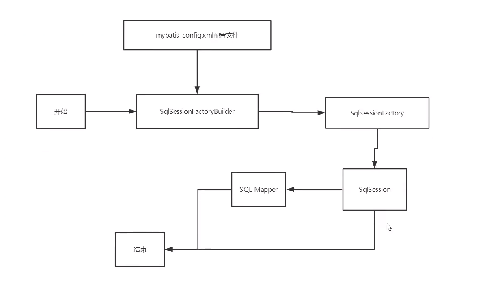
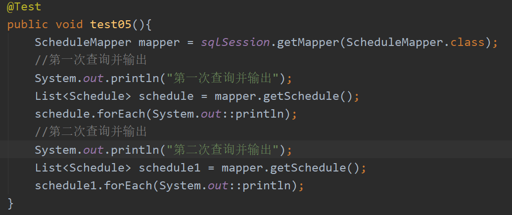
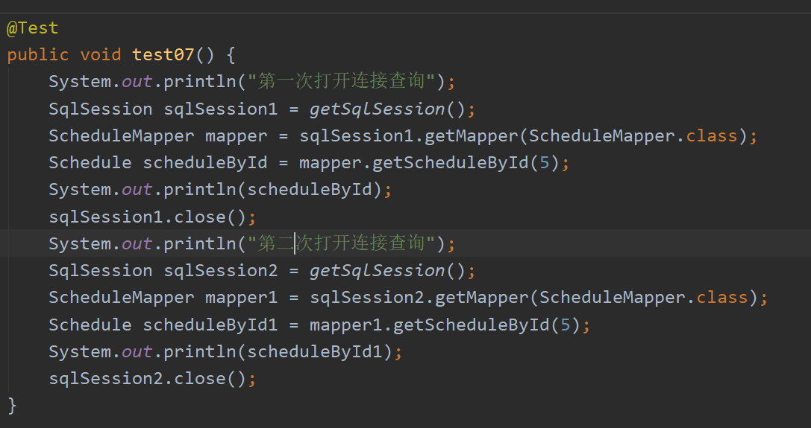
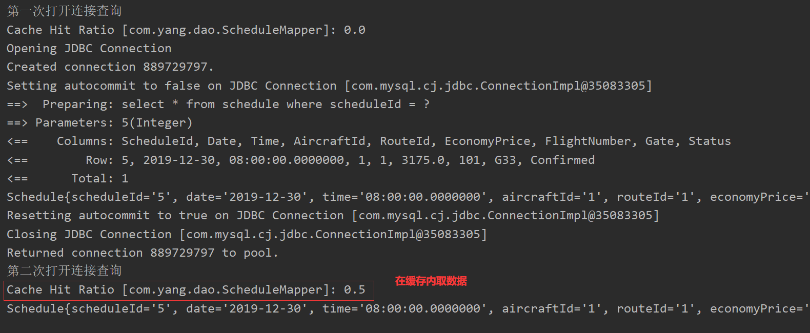
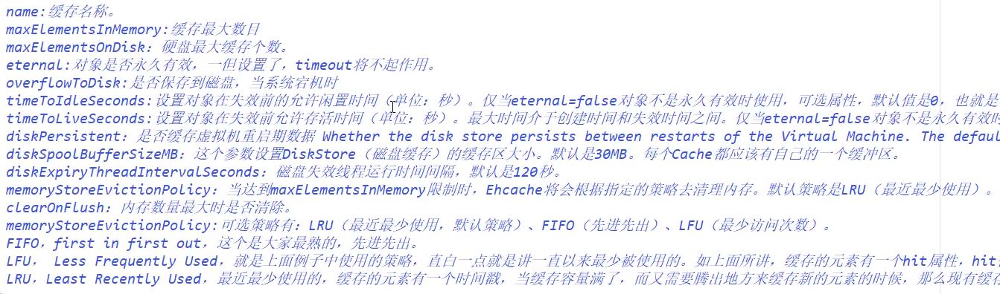
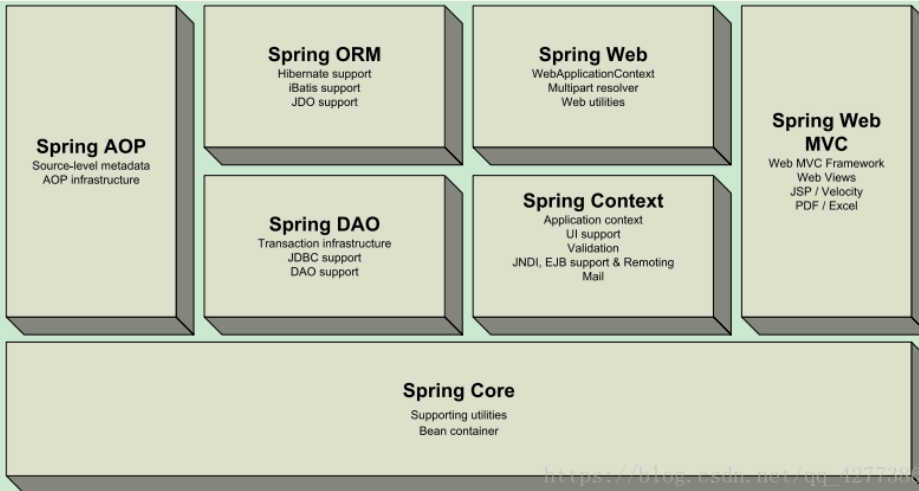
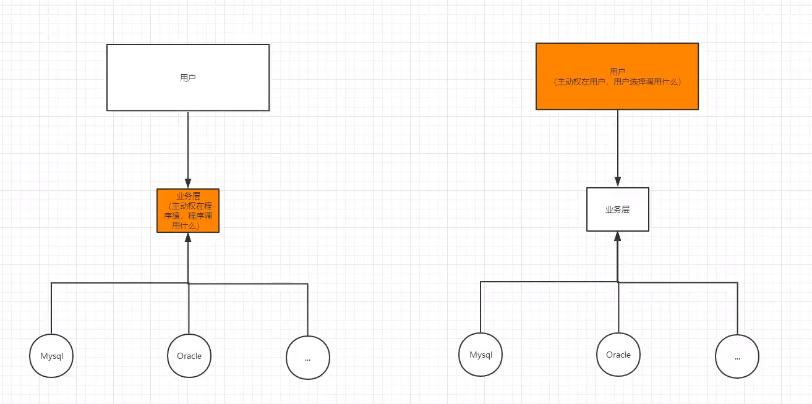
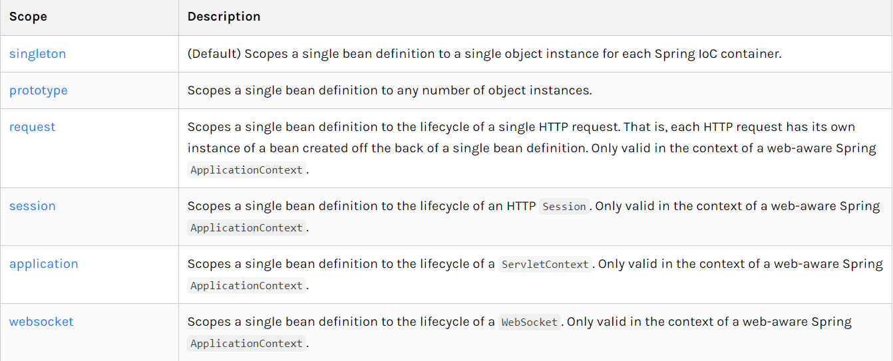
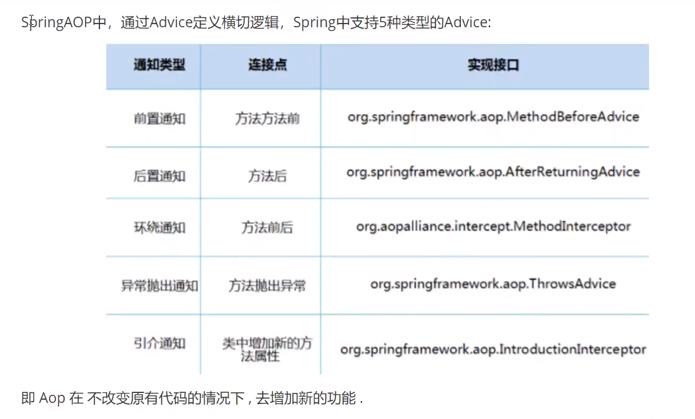
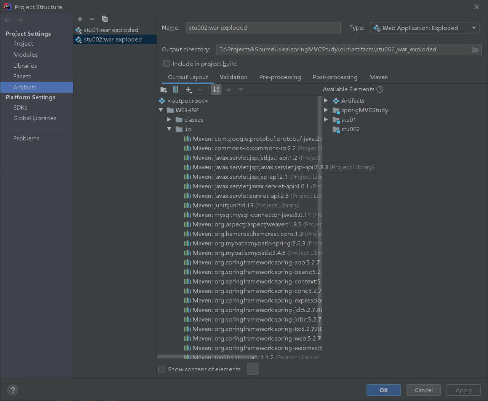

# Mybatis

## pojo工具类

```java
package com.yang.utils;

import org.apache.ibatis.session.SqlSession;

import java.io.BufferedWriter;
import java.io.File;
import java.io.FileOutputStream;
import java.io.OutputStreamWriter;
import java.sql.Connection;
import java.sql.PreparedStatement;
import java.sql.ResultSet;
import java.sql.SQLException;
import java.util.ArrayList;

/**
 * @auther YF
 * @create 2020-07-30-20:48
 */
public class PojoUtils {

    private static String showTables = "show tables";

    private static String desTable = "describe ";

    private static String packageName;

    private static StringBuilder sb;

    private static ArrayList<String> fieldNames;

    private static ArrayList<String> fieldTypes;

    private static String empty = " ";

    private static String table = "\t";

    private static String nextLine = "\n";

    static {
        String name = PojoUtils.class.getPackage().getName();
        String substring = name.substring(0, name.lastIndexOf(".") + 1);
        packageName = substring + "pojo";
    }

    private static String getPath(){
        return packageName.replace(".", "/");
    }

    public static void initPojo(Connection connection, String packageN){
        if (packageN != null || !"".equals(packageN.trim())){
            packageName = packageN;
        }
        initPojo(connection);
    }

    public static void initPojo(SqlSession sqlSession, String packageN){
        if (packageN != null || !"".equals(packageN.trim())){
            packageName = packageN;
        }
        initPojo(sqlSession);
    }

    public static void initPojo(Connection connection) {
        try(PreparedStatement statement = connection.prepareStatement(showTables);
            ResultSet rs = statement.executeQuery()) {
            while (rs.next()){
                String tableName = rs.getString(1);
                initPOJOFields(connection ,tableName);
            }
        }catch (Exception e){
            e.printStackTrace();
            System.out.println("pojo 初始化失败！");
        }
    }

    public static void initPojo(SqlSession sqlSession) {
        try {
            Connection connection = sqlSession.getConfiguration().getEnvironment().getDataSource().getConnection();
            initPojo(connection);
        } catch (SQLException e) {
            e.printStackTrace();
        }finally {
            sqlSession.close();
        }
    }

    public static void deletePojo(){
        File file = new File("src/main/java/" + getPath());
        if (file.exists()) {
            File[] files = file.listFiles();
            for (File file1 : files) {
                file1.delete();
            }
            file.delete();
        }
    }

    public static void rebuildPojo(Connection connection){
        deletePojo();
        initPojo(connection);
    }
    public static void rebuildPojo(SqlSession sqlSession){
        deletePojo();
        initPojo(sqlSession);
    }

    private static void initPOJOFields(Connection connection,String tableName) {
        if (fieldNames == null){
            fieldNames = new ArrayList<>();
        }else {
            fieldNames.clear();
        }
        if (fieldTypes == null){
            fieldTypes = new ArrayList<>();
        }else {
            fieldTypes.clear();
        }
        try(PreparedStatement statement = connection.prepareStatement(desTable + tableName);
            ResultSet rs = statement.executeQuery()) {
            while (rs.next()){
                fieldNames.add(headToLower(rs.getString(1)));
                String fileType = rs.getString(2);
                if (fileType.startsWith("char") || fileType.startsWith("varchar")){
                    fieldTypes.add("String");
                }else if (fileType.startsWith("int")){
                    fieldTypes.add("int");
                }else if (fileType.startsWith("double")){
                    fieldTypes.add("double");
                }else if (fileType.startsWith("longblob")){
                    fieldTypes.add("byte[]");
                }else if (fileType.startsWith("timestamp")){
                    fieldTypes.add("java.util.Date");
                }
            }
            createPojo(tableName);

        }catch (Exception e){
            e.printStackTrace();
        }
    }

    private static void createPojo(String tableName) {
        File file = new File("src/main/java/" + getPath());
        if (!file.exists()){
            file.mkdir();
        }
        String className = headToUpper(tableName);
        String path = file.getAbsolutePath() + "/" + className + ".java";
        try(BufferedWriter fos = new BufferedWriter(new OutputStreamWriter(new FileOutputStream(path)))){
            String classFile = getClassFile(className);
            fos.write(classFile);
            fos.flush();
        }catch (Exception e){
            e.printStackTrace();
        }
    }x
    /**
     * 建造类的核心方法
     * @param className
     * @return
     */
    private static String getClassFile(String className) {
        if (sb == null) {
            sb = new StringBuilder();
        }else {
            sb.delete(0, sb.length());
        }
        sb.append("package ").append(packageName).append(";").append(nextLine);
        sb.append("public class ").append(className).append(empty).append("implements java.io.Serializable")
            .append("{").append(nextLine);
        appendFields();
        appendEmptyConstructor(className);
        appendGetterAndSetter();
        appendToString(className);
        sb.append("}");
        return sb.toString();
    }
    /**
     * 生成属性
     */
    private static void appendFields(){
        for (int i = 0; i < fieldNames.size(); i++) {
            sb.append(table).append("private ").append(fieldTypes.get(i)).append(empty)
                .append(fieldNames.get(i)).append(";").append(nextLine);
        }
    }
    /**
     * 生成空参构造方法
     * @param className
     */
    private static void appendEmptyConstructor(String className){
        sb.append(table).append("public ").append(className).append("(){}").append(nextLine);
    }

    /**
     * 生成get和set方法
     */
    private static void appendGetterAndSetter(){
        for (int i = 0; i < fieldNames.size(); i++) {
            sb.append(table).append("public ").append(fieldTypes.get(i)).append(empty)
                .append("get").append(headToUpper(fieldNames.get(i))).append("(){").append(nextLine)
                .append(table).append(table).append("return this.").append(fieldNames.get(i))
                .append(";").append(nextLine).append(table).append("}").append(nextLine);
            sb.append(table).append("public void ").append("set").append(headToUpper(fieldNames.get(i)))
                .append("(").append(fieldTypes.get(i)).append(empty).append("value")
                .append("){").append(nextLine).append(table).append(table).append("this.")
                .append(fieldNames.get(i)).append(empty).append("=").append(empty)
                .append("value;").append(nextLine).append(table).append("}").append(nextLine);
        }
    }

    /**
     * 生成toString
     * @param className
     */
    private static void appendToString(String className){
        sb.append(table).append("@Override").append(nextLine);
        sb.append(table).append("public String toString() {").append(nextLine);
        sb.append(table).append(table).append("return ").append("\"")
            .append(className).append("{");
        for (int i = 0; i < fieldNames.size(); i++) {
            sb.append(i > 0 ? "\", " : "").append(fieldNames.get(i)).append("='\"+");
            sb.append(fieldNames.get(i)).append("+\"'")
                .append("\"+")
                .append(nextLine).append(table).append(table);
        }
        sb.append("\"}").append("\";").append(nextLine);

        sb.append(table).append("}").append(nextLine);
    }

    private static String headToUpper(String t){
        return t.substring(0, 1).toUpperCase() + t.substring(1);
    }
    private static String headToLower(String t){
        return t.substring(0, 1).toLowerCase() + t.substring(1);
    }
}
```


## xml文件骨架

## 核心配置

```xml
<?xml version="1.0" encoding="UTF-8" ?>
<!DOCTYPE configuration
        PUBLIC "-//mybatis.org//DTD Config 3.0//EN"
        "http://mybatis.org/dtd/mybatis-3-config.dtd">
<configuration>
    <environments default="development">
        <environment id="development">
            <transactionManager type="JDBC"/>
            <dataSource type="POOLED">
                <property name="driver" value="com.mysql.cj.jdbc.Driver"/>
                <property name="url" value=""/>
                <property name="username" value="用户名"/>
                <property name="password" value="密码"/>
            </dataSource>
        </environment>
    </environments>
    <mappers>
    </mappers>
</configuration>
```

### mapper配置

```xml
<?xml version="1.0" encoding="UTF-8" ?>
<!DOCTYPE mapper
        PUBLIC "-//mybatis.org//DTD Mapper 3.0//EN"
        "http://mybatis.org/dtd/mybatis-3-mapper.dtd">
<mapper namespace="dao接口的全限定名">
    <select id="对应的方法名" resultType="返回结果的全限定名">
    	sql语句
    </select>
</mapper>
```


## 简介

* MyBatis是一款优秀的持久层框架
* 它支持定制化SQL.存储过程以及高级映射。
* MyBatis避免了几乎所有的JDBC代码和手动设置参数以及获取结果集。
* MyBatis可以使用简单的XML或注解来配置和映射原生类型、接口和Java的POJO (Plain Old JavaObjects， 普通老式Java对象)为数据库中的记录。
* MyBatis本是apache的一一个开源项目iBatis, 2010年这个项目由apache software foundation迁移到了google code,并且改名为MyBatis 。
* 2013年11月迁移到Github。

### 获取

* maven仓库:

```xml
<!-- https ://mvnrepository. com/artifact/org. mybatis/mybatis -->
<dependency>
    <groupId>org. mybatis</groupId>
    <artifactId>mybatis</artifactId>
    <version>3.5.2</version>
</dependency>
```

* Github : https://github.com/mybatis/mybatis-3/releases
* 中文文档: https://mybatis.org/mybatis-3/zh/index.html

### 持久化

数据持久化

* 持久化就是将程序的数据在持久状态和瞬时状态转化的过程

* 内存:断电即失

* 数据库(Jdbc), io文件持久化。

### 持久层

Dao层，Service层， Controller层……

* 完成持久化工作的代码块
* 层界限十分明显。

## Mybatis程序

> jdbc url

```properties
jdbc:mysql://localhost:3306/session1?useSSL=false&useUnicode=true&characterEncoding=UTF-8&serverTimezone=Asia/Shanghai
```

* 编写配置：

```xml
<?xml version="1.0" encoding="UTF-8" ?>
<!DOCTYPE configuration
        PUBLIC "-//mybatis.org//DTD Config 3.0//EN"
        "http://mybatis.org/dtd/mybatis-3-config.dtd">
<configuration>
    <environments default="development">
        <environment id="development">
            <transactionManager type="JDBC"/>
            <dataSource type="POOLED">
                <property name="driver" value="com.mysql.cj.jdbc.Driver"/>
                <property name="url" value=""/>
                <property name="username" value="用户名"/>
                <property name="password" value="密码"/>
            </dataSource>
        </environment>
    </environments>
</configuration>
```

* 编写获取SqlSession的工具类

```java
public class JDBCUtils {
    private static SqlSessionFactory sqlSessionFactory;
    static {
        try(InputStream is = JDBCUtils.class.getClassLoader().getResourceAsStream("mybatis-info.xml")){
            sqlSessionFactory = new SqlSessionFactoryBuilder().build(is);
        }catch (Exception e){
            e.printStackTrace();
            throw new RuntimeException("connection failed!");
        }
    }
    public static SqlSession getSqlSession(){
        return sqlSessionFactory.openSession();
    }
}
```

* 编写代码

  * 编写实体类
  * 编写dao接口

  ```java
  public interface UserDao {
      List<Users> getUser();
  }
  ```

  * ~~编写dao接口实现类~~
  * 编写对应的mapper配置文件

  ```xml
  <?xml version="1.0" encoding="UTF-8" ?>
  <!DOCTYPE mapper
          PUBLIC "-//mybatis.org//DTD Mapper 3.0//EN"
          "http://mybatis.org/dtd/mybatis-3-mapper.dtd">
  <mapper namespace="dao接口的全限定名">
      <select id="对应的方法名" resultType="返回结果的全限定名">
      	sql语句
      </select>
  </mapper>
  ```

  * 测试

  ```java
  @Test
  public void testGetUser(){
      //获取sqlSession对象
      SqlSession sqlSession = JDBCUtils.getSqlSession();
      //获取对应的dao对象
      UserDao mapper = sqlSession.getMapper(UserDao.class);
      //执行得到结果
      List<Users> user = mapper.getUser();
      for (Users users : user) {
          System.out.println(users.getEmail());
      }
      //关闭连接
      sqlSession.close();
  }
  ```

## CRUD

* namespace

  * namespace中的包名要和Dao/mapper接口的包名一致

* **select**

  * id：就是对应的namespace中的方法名
  * resultType：sql语句执行的返回值
  * paramterType：参数类型
  * xml配置

  ```xml
  <select id="getUserById" parameterType="int" resultType="com.yang.pojo.Users">
      select * from users where users.userId = #{id}
  </select>
  ```

  * 代码

  ```java
  @Test
  public void testGetUser(){
      UserMapper mapper = sqlSession.getMapper(UserMapper.class);
      List<Users> user = mapper.getUser();
      for (Users users : user) {
          System.out.println(users.getEmail());
      }
      //关闭连接
      sqlSession.close();
  }
  ```

* **insert**

  * xml配置

  ```xml
  <insert id="insertUser" parameterType="com.yang.pojo.Users">
      insert into users (email, password) values (#{Email}, #{Password})
  </insert>
  ```

  * 代码

  ```java
  @Test
  public void testInsertUser(){
      UserMapper mapper = sqlSession.getMapper(UserMapper.class);
      HashMap<String, Object> hashMap = new HashMap<>();
      Users users = new Users();
      users.setEmail("fsafaefwea");
      users.setPassword("fdsfsse");
      int i = mapper.insertUser(users);
      //提交事务
      sqlSession.commit();
      sqlSession.close();
      System.out.println("修改"+(i > 0 ? "成功！" : "失败！"));
  }
  ```

* **delete**

  * xml配置

  ```xml
  <delete id="deleteUser" parameterType="int">
      delete from users where users.userId = #{id}
  </delete>
  ```

  * 代码

  ```java
  @Test
  public void testDeleteUser(){
      UserMapper mapper = sqlSession.getMapper(UserMapper.class);
      HashMap<String, Object> hashMap = new HashMap<>();
      int i = mapper.deleteUser(105);
      //提交事务
      sqlSession.commit();
      sqlSession.close();
      System.out.println("修改"+(i > 0 ? "成功！" : "失败！"));
  }
  ```

* **update**

  * xml配置

  ```xml
  <update id="updateUser" parameterType="java.util.Map">
      update users set users.password = #{pwd}, users.email = #{email}
      where users.userId = #{id}
  </update>
  ```

  * 代码

  ```java
  @Test
  public void testUpdateUser(){
      UserMapper mapper = sqlSession.getMapper(UserMapper.class);
      HashMap<String, Object> hashMap = new HashMap<>();
      hashMap.put("pwd", "123456");
      hashMap.put("email", "behappy@vip.sina.com");
      hashMap.put("id", 1);
      int i = mapper.updateUser(hashMap);
      //提交事务
      sqlSession.commit();
      sqlSession.close();
      System.out.println("修改"+(i > 0 ? "成功！" : "失败！"));
  }
  ```

* 注意：增删改需要提交事务

* 假设,我们的实体类，或者数据库中的表，字段或者参数过多,我们应当考虑使用Map

* 模糊查询

  * xml配置

  ```xml
  <select id="getUserByFirstName" parameterType="String" resultType="com.yang.pojo.Users">
      select * from users where users.firstName like '%' #{id} '%'
  </select>
  ```

  * 代码

  ```java
  @Test
  public void testGetUserByEmail(){
      UserMapper mapper = sqlSession.getMapper(UserMapper.class);
      List<Users> a = mapper.getUserByFirstName("ia");
      for (Users users : a) {
          System.out.println(users.getFirstName() + " " + users.getLastName());
      }
      sqlSession.close();
  }
  ```

## 配置解析

**核心配置文件**

* mybatis-config.xml
* MyBatis的配置文件包含了会深深影响MyBatis行为的设置和属性信息。

```xml
configuration (配置)
properties (属性)
settings (设置)
typeAliases (类型别名)
typeHandlers (类型处理器)
objectFactory (对象工厂)
plugins (插件)
environments (环境配置)
environment (环境变量)
transactionManager (事务管理器)
datasource (数据源)
```

### 环境配置(environments)

MyBatis可以配置成适应多种环境

尽管可以配置多个环境，但每个SqlSessionFactory实例只能选择一种环境

Mybatis默认的事务管理器就是JDBC，连接池: POOLED

### 属性. (properties)

我们可以通过properties属性来实现引用配置:文件

这些属性都是可外部配置且可动态替换的，既可以在典型的Java属性文件中配置,亦可通过properties元素的子元素来传递。[db.properties]

* 编写一个配置文件

```properties
driver=com.mysql.cj.jdbc.Driver
url=jdbc:mysql://localhost:3306/session1?useSSL=false&useUnicode=true&characterEncoding=UTF-8&serverTimezone=Asia/Shanghai
username=root
password=112358
```

* 在核心配置文件中引入
  * properties标签必须在configuration标签内的最前面

```xml
<properties resource="db.properties"/>
```

* 可以直接引入外部文件
* 可以在其中增加一-些属性配置
* 如果两个文件有同一个字段，优先使用外部配置文件的

### 类型别名(typeAliases)

* 类型别名是为Java类型设置一 个短的名字。
* 存在的意义仅在于用来减少类完全限定名的冗余。

```xml
<typeAliases>
    <typeAlias type="com.yang.pojo.Users" alias="user"/>
</typeAliases>
```

* 也可以指定一个包名， MyBatis 会在包名下面搜索需要的Java Bean
* 扫描实体类的包，它的默认别名就为这个类的类名，首字母小写

```xml
<typeAliases>
    <package name="com.yang.pojo"/>
</typeAliases>
```

* 在实体类比较少的时候，使用第一种方式。
* 如果实体类十分多,建议使用第二种。
* 第一种可以DIY别名，第二种则.不行，如果非要改，需要在实体.上增加注解

```xml
@Alias("别名")
public class Users {
}
```

### 设置

* 这是MyBatis中极为重要的调整设置，它们会改变MyBatis的运行时行为。

### 其他配置

*  typeHandlers (类型处理器)
* objectFactory_ (对象工厂)
* plugins插件
  * mybatis-generator-core
  * mybatis-plus
* 通用mapper

### 映射器（mappers）

MapperRegistry:注册绑定我们的Mapper文件;

* 方式一:

```xml
<mappers>
    <mapper resource=对应xml的路径/>
</mappers>
```

* 方式二:使用class文件绑定注册
  * 接口和他的Mapper配置文件必须同名
  * 接口和他的Mapper配置文件必须在同一一个包下

```xml
<mappers>
    <mapper class=对应类的全限定名/>
</mappers>
```

* 方式三:使用扫描包进行注入绑定
  * 和方式二需要注意的顶一样

```xml
<mappers>
    <package name=对应类的包名/>
</mappers>
```

## 生命周期和作用域



**生命周期，和作用域，是至关重要的，因为错误的使用会导致非常严重的并发问题。**

* **SqlSessionFactorybuilder**
  * 一旦创建了SqlSessionFactory, 就不再需要它了
  * 局部变量

* **SqISessionFactory**
  * 可以想象为数据库连接池
  * SqlSessionFactory - -旦被创建就应该在应用的运行期间一直存在，没有任何理由丢弃它或重新创建另一个实例
  * 因此SqlSessionFactory的最佳作用域是应用作用域
  * 最简单的就是使用单例模式或者静态单例模式
* **SqlSession**
  * 连接到连接池的一一个请求
  * SqlSession的实例不是线程安全的，因此是不能被共享的，所以它的最佳的作用域是请求或方法作用域
  * 用完之后需要赶紧关闭，否则资源被占用

**这里面的每一个Mapper, 就代表一个具体的业务 **

## ResultMap

**解决属性名和字段名不一致的问题**

解决方法：

* 起别名（在sql层面直接起别名）
* 使用resultMap
  * resu1tMap元素是MyBatis中最重要最强大的元素
  * ResultMap的设计思想是，对于简单的语句根本不需要配置显式的结果映射，而对于复杂-一点的语句只需要描述它们的关系就行了。
  * ResultMap最优秀的地方在于，虽然你已经对它相当了解了，但是根本就不需要显式地用到他们。

```xml
<resultMap id="mapId" type="对应的实体类">
    <!--        将实体类的字段名也数据库表的列名对应起来-->
    <result column="数据库内的列名" property="对应实体类的字段名"/>
</resultMap>
```

## 日志

### 日志工厂

如果一个数据库操作，出现了异常,我们需要排错。日志就是最好的助手!

曾经: sout、 debug

现在:日志工厂

* loglmpl（指定MyBatis所用日志的具体实现，未指定时将自动查找）
  * SLF4j
  * LOG4J
  * LOG4]2
  * JDK_ LOGGING
  * COMMONS_LOGGING
  * STDOUT_LOGGING
  * NO_LOGGING
* 在Mybatis中具体使用那个一日志实现，在设置中设定
* **STDOUT_ LOGGING标准日志输出**
* 在mybatis核心配置文件中，配置我们的日志
* 配置STDOUT_LOGGING为日志的实现

```xml
<settings>
    <setting name="logImpl" value="STDOUT_LOGGING"/>
</settings>
```

### LOG4J

* Log4j:
  * Log4j是Apache的-一个开源项目，通过使用Log4j,我们可以控制日志信息输送的目的地是控制台、文件、GUI组件
  * 我们也可以控制每一条日志的输出格式;
  * 通过定义每一条日志信息的级别，我们能够更加细致地控制日志的生成过程。
  * 通过一一个配置文件来灵活地进行配置，而不需要修改应用的代码。

* 导包

```xml
<!-- https://mvnrepository.com/artifact/log4j/log4j -->
<dependency>
    <groupId>log4j</groupId>
    <artifactId>log4j</artifactId>
    <version>1.2.17</version>
</dependency>
```

* log4j.properties

```properties
#将等级为DEBUG的日志信息输出到console和file这两个目的地，console 和file的定义在下面的代码
1og4j.rootLogger=DEBUG,console,file
#控制台输出的相关设置
1og4j.appender.console = org.apache.log4j.ConsoleAppender
1og4j.appender.console.Target = System.out
1og4j.appender.console.Threshold=DEBUG
1og4j.appender.console.layout=org.apache.1og4j.PatternLayout
1og4j.appender.console.layout.ConversionPattern=[%c]-%m%n
#文件输出的相关设置
1og4j.appender.file = org.apache.log4j.RollingFileAppender
1pg4j.appender.file.File=./log/yang.1og
1og4j.appender.file.iaxFileSize=10mb 
1og4j.appender.file.Threshold=DEBUG
1og4j.appender.file.layout=org.apache.log4j.PatternLayout
1og4j.appender.file.layout.ConversionPattern=[%p][%d{yy-MM-dd}][%c]%m%n
#日志输出级别
1og4j.logger.org.mybatis=DEBUG
1og4j.logger.java.sq1=DEBUG
1og4j.logger.java.sql.Statement=DEBUG
1og4j.logger.java.sq1.ResultSet=DEBUG
1og4j.logger.java.sq1.PreparedStatement=DEBUG
```

* 配置log4j为日志的实现

```xml
<settings>
    <setting name="logImpl" value="LOG4J"/>
</settings>
```

* 获取logger对象使用该对象实现手动打印日志

```java
Logger logger = Logger.getLogger(类名.class);
```

## 分页

### 使用Limit进行分页

* xml配置

```xml
<select id="getUserLimit" resultType="com.yang.pojo.Users">
    select * from users limit #{param1}, #{param2}
</select>
```

* 代码

```java
@Test
public void testGetUserLimit(){
    UserMapper mapper = sqlSession.getMapper(UserMapper.class);
    List<Users> user = mapper.getUserLimit(5, 5);
    for (Users users : user) {
        System.out.println(users.getUserId() + "--"+  users.getEmail());
    }
    //关闭连接
    sqlSession.close();
}
```

### parameterType多个参数的解决方法

* 使用map封装

```xml
<select id="getUserLimit2" parameterType="map" resultType="com.yang.pojo.Users">
    select * from users limit #{startIndex}, #{pageSize}
</select>
```

```java
@Test
public void testGetUserLimit2(){
    UserMapper mapper = sqlSession.getMapper(UserMapper.class);
    HashMap<String, Object> map = new HashMap<>();
    map.put("startIndex", 0);
    map.put("pageSize", 5);
    List<Users> user = mapper.getUserLimit2(map);
    for (Users users : user) {
        System.out.println(users.getUserId() + "--"+  users.getEmail());
    }
    //关闭连接
    sqlSession.close();
}
```

* 不写parameterType使用arg或param使用方式：
  * arg0，arg1，arg2 ……
  * param1，param2，param3 ……

```xml
<select id="getUserLimit" resultType="com.yang.pojo.Users">
    select * from users limit #{param1}, #{param2}
</select>
```

```java
@Test
public void testGetUserLimit(){
    UserMapper mapper = sqlSession.getMapper(UserMapper.class);
    List<Users> user = mapper.getUserLimit(5, 5);
    for (Users users : user) {
        System.out.println(users.getUserId() + "--"+  users.getEmail());
    }
    //关闭连接
    sqlSession.close();
}
```

* xml转义字符

|  `&lt;`  |  <   | 小于号 |
| :------: | :--: | :----: |
|  `&gt;`  |  >   | 大于号 |
| `&amp;`  |  &   |   和   |
| `&apos;` |  ’   | 单引号 |
| `&quot;` |  "   | 双引号 |

### 使用RowBounds实现分页

* xml配置

```xml
<select id="getUserByRowBounds" resultType="com.yang.pojo.Users">
    select * from users
</select>
```

* 代码

```java
@Test
public void getUserByRowBounds(){
    List<Users> users = sqlSession.selectList("com.yang.dao.UserMapper.getUserByRowBounds", null, new RowBounds(5, 5));
    for (Users user: users) {
        System.out.println(user.getUserId() + "--"+  user.getEmail());
    }
    //关闭连接
    sqlSession.close();
}
```

## 使用注解开发

### 面向接口编程

* 大家之前都学过面向对象编程，也学习过接口，但在真正的开发中，很多时候我们会选择面向接口编程
* 根本原因: 解耦 ,可拓展,提高复用，分层开发中,上层不用管具体的实现,大家都遵守共同的标准,使得开发变得容易，规范性更好
* 在一一个面向对象的系统中，系统的各种功能是由许许多多的不同对象协作完成的。在这种情况下，各个对象内部是如何实现自己的,对系统设计人员来讲就不那么重要了
* -各个对象之间的协作关系则成为系统设计的关键。小到不同类之间的通信，大到各模块之间的交互，在系统设计之初都是要着重考虑的,这也是系统设计的主要工作内容。面向接口编程就是指按照这种思想来编程
* 关于接口的理解
  * 接口从更深层次的理解，应是定义(规范，约束)与实现(名实分离的原则)的分离
  * 接口的本身反映了系统设计人员对系统的抽象理解
  * 接口应有两类:
    * 第一类是对一个个体的抽象，它可对应为-一个抽象体(abstract class)
    * 第二类是对一个个体某一-方 面的抽象，即形成一个抽象面(interface) 
  * 个体有可能有多个抽象面。抽象体与抽象面是有区别的

* 三个面向区别
  * 面向对象是指，我们考虑问题时，以对象为单位,考虑它的属性及方法.
  * 面向过程是指,我们考虑问题时，以一个具体的流程(事务过程)为单位，考虑它的实现.
  * 接口设计与非接口设计是针对复用技术而言的，与面向对象(过程)不是一个问题.更多的体现就是对系统整体的架构.

### 使用注解开发

* 编写Mapper接口

```java
public interface UserMapper {
    @Select("select * from users")
    List<Users> getUser();
}
```

* 在核心配置文件中绑定接口

```xml
<mappers>
    <mapper class="com.yang.mapper.UserMapper"/>
</mappers>
```

* 测试

```java
@Test
public void testGetUser(){
    UserMapper mapper = sqlSession.getMapper(UserMapper.class);
    List<Users> user = mapper.getUser();
    for (Users users : user) {
        System.out.println(users.getUserId() + "--" + users.getEmail());
    }
}
```

* 缺点：
  * 无法使用ResultMap
  * 在sql参数较多时会很麻烦
* 插入：@Insert("sql语句")
* 修改：@Update("sql语句")
* 删除：@Delete("sql语句")
* 关于@Param()注解
  * 基本类型的参数或者String类型,需要加上
  * 引用类型不需要加
  * 如果只有一一个基本类型的话，可以忽略，但是建议大家都加上
  * 我们在SQL中弓|用的就是我们这里的@Param()中设定的属性名

* #{}和${}的区别就是Statement和PreparedStatement的区别

## 一对多和多对一的处理

### 多对一

* 按照查询嵌套处理

```xml
<resultMap id="tsMap" type="student">
<!--    将该属性与表中的tid关联起来-->
<!--    select 相当于查询跟tid关联的值赋给teacher属性-->
    <association property="teacher" javaType="teacher" column="tid" select="getTeacher"/>
</resultMap>
<select id="getStudent" resultMap="tsMap">
    select * from student
</select>
<select id="getTeacher" resultType="teacher">
    select * from teacher where id = #{id}
</select>
```

* 按照结果嵌套处理

```xml
<resultMap id="tsMap" type="student">
    <result property="id" column="sid"/>
    <result property="name" column="sname"/>
    <!--    将该引用属性里面的属性与链表查询的值关联起来-->
    <association property="teacher" javaType="teacher">
        <result property="name" column="tname"/>
        <result property="id" column="tid"/>
    </association>
</resultMap>
<select id="getStudent" resultMap="tsMap">
    select s.id sid, s.name sname, t.id tid, t.name tname
    from student s, teacher t where s.tid = t.id
</select>
```

### 一对多

* 按照查询嵌套处理

```xml
<resultMap id="tsMap" type="teacher">
    <result property="id" column="id"/>
    <!-- 将集合属性进行关联-->
    <collection property="students" javaType="java.util.ArrayList" ofType="student" column="id" select="getStudents"/>
</resultMap>
<select id="getTeacher" resultMap="tsMap">
    select * from teacher
</select>
<select id="getStudents" resultType="student">
    select * from student where tid = #{tid}
</select>
```


* 按照结果嵌套处理

```xml
<resultMap id="tsMap" type="teacher">
    <result property="id" column="tid"/>
    <result property="name" column="tname"/>
    <!-- 将集合属性进行关联-->
    <collection property="students" javaType="java.util.ArrayList" ofType="student">
        <result property="id" column="sid"/>
        <result property="name" column="sname"/>
    </collection>
</resultMap>
<select id="getTeacher" resultMap="tsMap">
    select t.id tid, t.name tname, s.id sid, s.name sname
    from teacher t, student s
    where t.id = s.tid
</select>
```

### 小结

* 关联- association[多对一]

* 集合- collection [一对多]

* javaType & ofType

  * JavaType用来指定实体类中属性的类型

  * ofType用来指定映射到List或者集合中的pojo类型,泛型中的约束类型!

## 动态sql

### if

```xml
<if test="arg0 != null">
    `Date` = #{arg0}
</if>
<if test="arg1 != null">
    and `EconomyPrice` = #{arg1}
</if>
<if test="arg2 != null">
    and `Gate` = #{arg2}
</if>
```

### choose，when，otherwise

* 就是switch，case，default

```xml
<choose>
    <when test="arg0 != null">
        `Date` = #{arg0}
    </when>
    <when test="arg1 != null">
        and `EconomyPrice` = #{arg1}
    </when>
    <when test="arg2 != null">
        and `Gate` = #{arg2}
    </when>
    <otherwise>

    </otherwise>
</choose>
```


### set，where

* 去除写动态sql时多余的符号或关键字

### foreach

```xml
<foreach collection="gates" item="gate"
         open="`Gate` in (" separator="," close=")">
    #{gate}
</foreach>
```

**动态SQL就是在拼接SQL语句，我们只要保证SQL的正确性，按照SQL的格式，去排列组合就可以了**

**现在Mysq|中写出完整的SQL,再对应的去修改成为我们的动态SQL实现通用即可**

## 缓存

### 简介

* 什么是缓存[ Cache ]
  * 存在内存中的临时数据
  * 用户经常查询的数据放在缓存(内存)中，用户去查询数据就不用从磁盘上(关系型数据库数据文件)查询，从缓存中查询，从而提高查询效率，解决了高并发系统的性能问题
* 为什么使用缓存
  * 减少和数据库的交互次数,减少系统开销，提高系统效率
* 什么样的数据能使用缓存?
  * 经常查询并且不经常改变的数据

### Mybatis缓存

* MyBatis包含一个非常强大的查询缓存特性,它可以非常方便地定制和配置缓存。缓存可以极大的提升查询效率。

* MyBatis系统中默认定义了两级缓存: - -级缓存和二级缓存

  * 默认情况下，只有一 -级缓存开启。 (SqISession级别的缓存， 也称为本地缓存)
  * 二级缓存需要手动开启和配置， 他是基于namespace级别的缓存。

  * 为了提高扩展性，MyBatis定义了缓存接口Cache。 我们可以通过实现Cache接口来自定义二级缓存

### 一级缓存

* 一级缓存也叫本地缓存:
  * sqlSession从开启到关闭前得查询得属性会被缓存
  * 与数据库同一次会话期间查询到的数据会放在本地缓存中
  * 以后如果需要获取相同的数据，直接从缓存中拿，没必须再去查询数据库



* 两次查询实际上只查询了一次第二次输出从缓存里取数


* 缓存失效的情况: 
  * 查询不同的东西
  * 增删改操作，可能会改变原来的数据，所以必定会刷新缓存!
  * 查询不同的Mapper.xml
  * 手动清理缓存：
    * 在下一次查询时调用`sqlSession.clearCache()`方法

**一级缓存默认是开启的， 只在一次SqlSession中有效, 也就是拿到连接到关闭连接这个区间段**

**一级缓存就是一个map**

### 13.4、 二级缓存

* 二级缓存也叫全局缓存，一级缓存作用域太低了，所以诞生了二级缓存
* 基于namespace级别的缓存，一个名称空间，对应一个二级缓存;
* 工作机制
  * 一个会话查询一条数据，这个数据就会被放在当前会话的一级缓存中;
  * 如果当前会话关闭了，这个会话对应的一-级缓存就没了;但是我们想要的是，会话关闭了，- -级缓存中的数据被保存到二级缓存中;
  * 新的会话查询信息，就可以从二级缓存中获取内容;
  * 不同的mapper查出的数据会放在自己对应的缓存(map)中
* 在核心配置文件里显示开启二级缓存（默认已开启）

```xml
<setting name="cacheEnabled" value="true'"/>
```

* 在对应得mapper.xml文件内加入标签

```xml
<!--    默认方式-->
<cache/>
<!--    自定义方式-->
<cache eviction="FIFO"
       flushInterval="60000"
       size="512"
       readOnly="true"/>
```





* 注意：**开启二级缓存对使用注解完成的sql方法无效**
* **需要缓存的类必须实现序列化接口**
* 只要开启了二级缓存,在同一个Mapper下就有效
* 所有的数据都会先放在一级缓存中
* 只有当会话提交，或者关闭的时候，才会提交到二级缓冲中

## 缓存原理


* 缓存顺序：
  1. 先看二级缓存中有没有
  2. 再看一级缓存中有没有
  3. 查询数据库

## 自定义缓存

Ehcache是一种广泛使用的开源Java分布式缓存。主要面向通用缓存

```xml
<dependency>
    <groupId>org.mybatis.caches</groupId>
    <artifactId>mybatis-ehcache</artifactId>
    <version>1.1.0< /version>
</dependency>
```

* 在对应得=的mapper.xml文件内指定缓存的实现方式

```xml
<cache type="org.mybatis.caches.ehcache.EhcacheCache"/>
```

* 编写ehcache配置文件ehcache.xml

```xml
<?xml version="1.0" encoding="UTF-8"?>
<ehcache xmlns:xsi="http://www.w3.org/2001/XMLSchema-instance"
         xsi:noNamespaceSchemaLocation="http://ehcache.org/ehcache.xsd"
         updateCheck="false">

    <diskStore path="./tmpdir/Tmp_EhCache"/>

    <defaultCache
                  eternal="false"
                  maxElementsInMemory="10000"
                  overflowToDisk="false"
                  diskPersistent="false"
                  timeToIdleSeconds="1800"
                  timeToLiveSeconds="259200"
                  memoryStoreEvictionPolicy="LRU"/>

    <cache
           name="cloud_user"
           eternal="false"
           maxElementsInMemory="5000"
           overflowToDisk="false"
           diskPersistent="false"
           timeToIdleSeconds="1800"
           timeToLiveSeconds="1800"
           memoryStoreEvictionPolicy="LRU"/>
</ehcache>
```



# Spring

## idea创建module跳language level问题

```xml
<properties>
    <project.build.sourceEncoding>UTF-8</project.build.sourceEncoding>
    <maven.compiler.source>1.8</maven.compiler.source>
    <maven.compiler.target>1.8</maven.compiler.target>
</properties>
<!-- 或在<build>标签里面添加-->
<plugins>
    <plugin>
        <groupId>org.apache.maven.plugins</groupId>
        <artifactId>maven-compiler-plugin</artifactId>
        <version>3.7.0</version>
        <configuration>
            <source>1.8</source>
            <target>1.8</target>
        </configuration>
    </plugin>
</plugins>
```


## xml文件骨架

```xml
<?xml version="1.0" encoding="UTF-8"?>
<beans xmlns="http://www.springframework.org/schema/beans"
       xmlns:xsi="http://www.w3.org/2001/XMLSchema-instance"
       xsi:schemaLocation="http://www.springframework.org/schema/beans
      https://www.springframework.org/schema/beans/spring-beans.xsd">

</beans>
```

```xml
<?xml version="1.0" encoding="UTF-8"?>
<beans xmlns="http://www.springframework.org/schema/beans"
    xmlns:xsi="http://www.w3.org/2001/XMLSchema-instance"
    xmlns:context="http://www.springframework.org/schema/context"
    xsi:schemaLocation="http://www.springframework.org/schema/beans
        https://www.springframework.org/schema/beans/spring-beans.xsd
        http://www.springframework.org/schema/context
        https://www.springframework.org/schema/context/spring-context.xsd">

    <context:annotation-config/>

</beans>
```


## 简介

* 2002， 首次推出了Spring框架的雏形: interface21框架!
* Spring框架即以interface21框架为基础，经过重新设计，并不断丰富其内涵，于2004年3月24日发布了1.0正式版。
* Rod Johnson，Spring Framework创始人
* spring理念: 使现有的技术更加容易使用，本身是一 个大杂烩，整合了现有的技术框架!
* SSH : Struct2 + Spring + Hibernate

* SSM : SpringMvc + Spring + Mybatis
* 文档：https://docs.spring.io/spring/docs/5.2.0.RELEASE/spring-framework-reference/core.html#spring-core
* 官方下载地址: http://repo.spring.io/release/org/springframework/spring
* GitHub: https://github.com/spring:projects/spring-framework

```xml
<dependency>
    <groupId>org.springframework</groupId>
    <artifactId>spring-webmvc</artifactId>
    <version>5.2.7.RELEASE</version>
</dependency>
<!--spring整合mybatis-->
<dependency>
    <groupId>org.springframework</groupId>
    <artifactId>spring-jdbc</artifactId>
    <version>5.2.7.RELEASE</version>
</dependency>

```

* Spring是一 个开源的免费的框架(容器) 
* Spring是一 个轻量级的、非入侵式的框架
* 控制反转(IOC) ，面向切面编程(AOP) 
* 支持事务的处理, 对框架整合的支持
* **Spring就是一 个轻量级的控制反转(IOC) 和面向切面编程(AOP)的框架!**

### 组成



* 扩展：
  * Spring Boot
    * 一个快速开发的脚手架。
    * 基于SpringBoot可以快速的开发单个微服务。
    * 约定大于配置!
  * Spring Cloud
    * SpringCloud 是基于SpringBoot实现的。
* 因为现在大多数公司都在使用SpringBoot进行快速开发,学习SpringBoot的前提， 需要完全掌握Spring及SpringMVC

## IOC理论

1. UserDao接口
2. UserDaoImpl实现类
3. UserService接口
4. UserServiceImpl业务实现类

在我们之前的业务中,用户的需求可能会影响我们原来的代码，我们需要根据用户的需求去修改原代码!如果程序代码量十分大，修改一次的成本代价十分昂贵!

使用set注入属性将将控制器交到用户手上用户向调用那个UserDao实现类直接在UserServiceImpl里面设置就行了

```java
private UserDao userDao;
//使用set实现属性的注入
public void setUserDao(UserDao userDao) {
    this.userDao = userDao;
}
```

降低耦合性



> **IOC**

* 控制反转loC(Inversion of Control),是一种设计思想，DI(依赖注入)是实现IoC的一种方法，也有人认为DI只是IoC的另一种说法。没有IoC的程序中，我们使用面向对象编程， 对象的创建与对象间的依赖关系完全硬编码在程序中，对象的创建由程序自己控制，控制反转后将对象的创建转移给第三方，个人认为所谓控制反转就是:获得依赖对象的方式反转了。
* 采用XML方式配置Bean的时候，Bean的定义信息 是和实现分离的，而采用注解的方式可以把两者合为一体，Bean的定义信息直接以注解的形式定义在实现类中，从而达到了零配置的目的。
* **控制反转是一种通过描述(XML或注解)并通过第三方去生产或获取特定对象的方式。在Spring中实现控制反转的是IoC容器，其实现方法是依赖注入(Dependency Injection,DI)**

### spring实现对象的托管

* 编写实体类gettersetter方法

```java
public class Hello {
    private String name;

    public String getName() {
        return name;
    }

    public void setName(String name) {
        this.name = name;
    }

    @Override
    public String toString() {
        return "Hello{" +
            "name='" + name + '\'' +
            '}';
    }
}
```

* 编写bean.xml文件

```xml
<?xml version="1.0" encoding="UTF-8"?>
<beans xmlns="http://www.springframework.org/schema/beans"
       xmlns:xsi="http://www.w3.org/2001/XMLSchema-instance"
       xsi:schemaLocation="http://www.springframework.org/schema/beans
                           https://www.springframework.org/schema/beans/spring-beans.xsd">
    <!--    使用bean标签对对象进行托管-->
    <bean id="hello" class="com.yang.pojo.Hello">
        <!--        初始化属性的值-->
        <property name="name" value="hello java"/>
    </bean>
</beans>
```

* 测试

```java
@Test
public void test02(){
    //创建ClassPathXmlApplicationContext读取beans.xml文件
    ApplicationContext context = new ClassPathXmlApplicationContext("beans.xml");
    //调用getBean("id")方法获取托管的对象
    Hello hello = context.getBean("hello", Hello.class);
    System.out.println(hello);
}
```

* 使用bean标签托管的对象默认使用单例模式创建，就是同一个id获取到的对象是同一个对象

```java
//创建ClassPathXmlApplicationContext读取beans.xml文件
ApplicationContext context = new ClassPathXmlApplicationContext("beans.xml");
//调用getBean("id")方法获取托管的对象
Hello hello1 = context.getBean("hello", Hello.class);
Hello hello2 = context.getBean("hello", Hello.class);
System.out.println(hello1 == hello2);//true
```

* Hello对象是谁创建的?
  * hello对象是由Spring创建的
* Hello对象的属性是怎么设置的?
  * hello对象的属性是由Spring容器设置的,
* 这个过程就叫控制反转:
  * 控制：谁来控制对象的创建,传统应用程序的对象是由程序本身控制创建的,使用Spring后,对象是由Spring来创建的.
  * 反转：程序本身不创建对象,而变成被动的接收对象.
* 依赖注入:就是利用set方法来进行注入的.
* IOC是一种编程思想,由主动的编程变成被动的接收.
* 可以通过newClassPathXmlApplicationContext去浏览一下底层源码 .

* ,我们彻底不用再程序中去改动了,要实现不同的操作,只需要在xml配置文件中进行修改，IOC：对象由Spring来创建,管理,装配!

## IOC创建对象的方式

* 使用无参构造 默认
* 使用有参构造

```xml
<!-- 使用下标-->
<bean id="user" class="com.yang.pojo.User" scope="prototype">
    <constructor-arg name="0" value="张三"/>
    <constructor-arg name="1" value="18"/>    
</bean>
<!-- 使用参数名-->
<bean id="user" class="com.yang.pojo.User" scope="prototype">
    <constructor-arg name="name" value="张三"/>
    <constructor-arg name="age" value="18"/>    
</bean>
<!-- 使用参数类型-->
<bean id="user" class="com.yang.pojo.User" scope="prototype">
    <constructor-arg name="java.lang.String" value="张三"/>
    <constructor-arg name="int" value="18"/>    
</bean>
```

* 在配置文件加载的时候，容器中管理的对象就已经初始化了!

## Spring配置

### 别名

```xml
<!-- bean的name标签也可以取别名，并且可以一次取多个别名-->
<bean id="user" class="com.yang.pojo.User" scope="prototype"
      name="别名1,别名2,……">
    <property name="name" value="张三"/>	
    <property name="age" value="18"/>
</bean>
<!--取别名-->
<alias name="user" alias="别名"/>
```

### import

* 这个import,一般用于团队开发使用，他可以将多个配置文件，导入合并为-一个
* 假设，现在项目中有多个人开发,这三个人复制不同的类开发,不同的类需要注册在不同的bean中，我们可以利
* 用import将所有人的beans.xml合并为一个总的!
* applicationContext.xml文件里面导入其他文件

```xml
<import resource="beans.xm1"/>
<import resource="beans2.xm]"/>
<import resource="beans3.xm1"/>
```

* 使用的时候，直接使用总的配置就可以了


## 依赖注入

### 构造器注入（上面）

### set注入

* 复杂注入：
* java类

```java
public class Student {
    private String name;
    private int age;
    private Address address;
    private List<Integer> is;
    private Set<String> ss;
    private Map<String, Integer> ms;
    private int[] ins;
    ……getter和setter方法
}
public class Address {
    private String home;
    private List<String> v2;
    ……getter和setter方法
}
```

* xml

```xml
<!--    address注入-->
<bean id="address" class="com.yang.pojo.Address">
    <property name="home" value="湖北"/>
    <property name="v2">
        <list value-type="java.lang.String">
            <value>wqew</value>
            <value>wqeweww</value>
            <value>wqrewew</value>
        </list>
    </property>
</bean>
<!--    student注入-->
<bean id="student" class="com.yang.pojo.Student">
    <property name="name" value="小明"/>
    <property name="age" value="18"/>
    <property name="address" ref="address"/>
    <property name="is">
        <list value-type="java.lang.Integer">
            <value>43</value>
            <value>4232</value>
            <value>44</value>
        </list>
    </property>
    <property name="ins">
        <array>
            <value>34</value>
            <value>3767</value>
            <value>376564</value>
            <value>3435434</value>
        </array>
    </property>
    <property name="ss">
        <set value-type="java.lang.String">
            <value>weqwq</value>
            <value>weqwqerwer</value>
            <value>weqrrewrewrwrewq</value>
        </set>
    </property>
    <property name="ms">
        <map key-type="java.lang.String" value-type="java.lang.Integer">
            <entry key="a">
                <value>44</value>
            </entry>
            <entry key="b">
                <value>4324</value>
            </entry>
<!--            <entry key="a" value="44"/>-->
<!--            <entry key="b" value="4324"/>-->
        </map>
    </property>
</bean>
```

* map和properties的注入方式：

  * map：

  ```xml
  <map key-type="java.lang.String" value type="java.lang.Integer">
  </map>
  <entry key="键">
      <value>值</value>
  </entry>
  <entry key="键" value="值"/>
  ```

  * properties:

  ```xml
  <props>
      <prop key="键">值</prop>
      <prop key="键">值</prop>
      <prop key="键">值</prop>
  </props>
  ```

  

### 拓展方式注入

* 必须导入xml约束（在bean标签内导入）
  * p：xmlns:p="http://www.springframework.org/schema/p"
  * c：xmlns:c="http://www.springframework.org/schema/c"

* p命名空间：

```xml
<!--p命名空间注入-->
<bean id="user" class="com.yang.pojo.User" p:name="张三" p:age="18"/>
```

* c命名空间：

```xml
<!--c命名空间注入-->
<bean id="user3" class="com.yang.pojo.User" c:name="张三" c:age="18"/>
```

### bean的作用域



* singleton：单例模式

  * 默认开启
  * 使用getbean()获取到的对象都是一个对象

  ```xml
  <!--    可以显示开启-->
  <bean name="user" class="com.yang.pojo.User" scope="singleton">
      <property name="name" value="张三"/>
      <property name="age" value="18"/>
  </bean>
  ```

* prototype：原型模式

  * 使用getbean()获取到的对象相当于new一个对象

  ```xml
  <bean name="user" class="com.yang.pojo.User" scope="prototype">
      <property name="name" value="张三"/>
      <property name="age" value="18"/>
  </bean>
  ```

* request、session、 application、 这些个只能在web开发中使用到

## bean的自动装配

* autowire

  * byName：根据容器类的id查找跟该属性名相同的bean	
  * 使用byname的时候，需要保证所有bean的id唯一， 并且这个bean需要和自动注入的属性的set方法的值一致!

  ```xml
  <bean id="dog" class="com.yang.pojo.Dog" p:name="小黑"/>
  <bean id="cat" class="com.yang.pojo.Cat" p:name="小花"/>
  <bean id="people" class="com.yang.pojo.People" p:name="小明" autowire="byName"/>
  ```

  * byType：查找容器内的bean的类型是否符该属性的类型相同，相同则装配
  * 使用bytype的时候，需要保证所有bean的class唯一 , 并且这个bean需要和自动注入的属性的类型一致!

  ```xml
  <bean id="dog" class="com.yang.pojo.Dog" p:name="小黑"/>
  <bean id="cat" class="com.yang.pojo.Cat" p:name="小花"/>
  <bean id="people" class="com.yang.pojo.People" p:name="小明" autowire="byName"/>
  ```

  * ##### 使用注解实现自动装配

    * 导入约束，配置注解的支持：

    ```xml
    <?xml version="1.0" encoding="UTF-8"?>
    <beans xmlns="http://www.springframework.org/schema/beans"
        xmlns:xsi="http://www.w3.org/2001/XMLSchema-instance"
        xmlns:context="http://www.springframework.org/schema/context"
        xsi:schemaLocation="http://www.springframework.org/schema/beans
            https://www.springframework.org/schema/beans/spring-beans.xsd
            http://www.springframework.org/schema/context
            https://www.springframework.org/schema/context/spring-context.xsd">
    
        <context:annotation-config/>
    
    </beans>
    ```

    * @Autowired
      * required属性：指定为false说明该字段可以为空

    ```java
    public class People {
        private String name;
        @Autowired
        private Dog dog;
        @Autowired
        private Cat cat;
    }
    ```

    ```xml
    <?xml version="1.0" encoding="UTF-8"?>
    <beans xmlns="http://www.springframework.org/schema/beans"
           xmlns:xsi="http://www.w3.org/2001/XMLSchema-instance"
           xmlns:context="http://www.springframework.org/schema/context"
           xsi:schemaLocation="http://www.springframework.org/schema/beans
            https://www.springframework.org/schema/beans/spring-beans.xsd
            http://www.springframework.org/schema/context
            https://www.springframework.org/schema/context/spring-context.xsd">
        <context:annotation-config/>
        <bean id="dog" class="com.yang.pojo.Dog"/>
        <bean id="cat" class="com.yang.pojo.Cat"/>
        <bean id="people" class="com.yang.pojo.People"/>
    </beans>
    ```

    * 如果@Autowired自动装配的环境比较复杂，自动装配无法通过一个注解[@Autowired] 完成的时候、我们可以
    * 使用@Qualifier(value="xx")去配置@Autowired的使用，指定一个唯一 的bean对象注入!

    ```java
    public class People {
        private String name;
        @Autowired
        @Qualifier("dog")
        private Dog dog;
        @Autowired
        @Qualifier("cat")
        private Cat cat;
    }
    ```

    * java自带的@Resources注解也可以使用这个注解相当于@Autowired+@Qualifier(value="xx")

## 使用注解开发

##### 在Spring4之后，要使用注解开发，必须要保证aop的包导入了

##### 使用注解需要导入context约束,增加注解的支持!

* bean

* 属性如何注入
  * 在类上面加@Component注解

```java
@Component
public class People {
    private String name;
    private Dog dog;
    private Cat cat;
}
```

* 衍生的注解
  * @Component有几个衍生注解, 我们在web开发中，会按照mvc三层架构分层
    * dao [@Repository]
    * service[ @Service]
    * controller [ @Controller ]
  * 这四个注解功能都是一 样的，都是代表将某个类注册到Spring中，装配Bean

* 自动装配置
  * @Autowired
  * @Qualifier("")

* 作用域

  * @Scope("模式")

  ```java
  @Component
  @Scope("prototype")
  public class People {
      private String name;
      private Dog dog;
      private Cat cat;
  }
  ```

  

* 小结

  * xml与注解:

    * xml更加万能，适用于任何场合!维护简单方便
    * 注解不是自己类使用不了，维护相对复杂!

  * xml与注解最佳实践: 

    *  xml用来管理bean;
    * 注解只负责完成属性的注入;
    * 我们在使用的过程中，只需要注意一个问题: 必须让注解生效，就需要开启注解的支持

    ```xml
    <context:component-scan base-package="包名"/>
    <context:annotation-config/>
    ```

## 使用Java的方式配置Spring

##### 我们现在要完全不使用Spring的xml配置了，全权交给Java来做! 

##### JavaConfig是Spring的一-个子项目，在Spring4之后, 它成为了一个核心功能!

```java
@Configuration
//扫描包
@ComponentScan("com.yang.pojo")
//合并两个Configuration配置类
@Import(CustomConfig2.class)
public class CustomConfig {
    @Bean
    public User user(){
        return new User();
    }
}
```

## AOP

AOP (Aspect Oriented Programming)意为:面向切面编程，通过预编译方式和运行期动态代理实现程序功能的统- -维护的一种技术。AOP是OOP的延续,是软件开发中的一个热点，也是Spring框架中的一个重要内容,是函数式编程的一种衍生范型。利用AOP可以对业务逻辑的各个部分进行隔离，从而使得业务逻辑各部分之间的耦合度降低，提高程序的可重用性，同时提高了开发的效率。

### AOP在Spring中的作用

##### 提供声明式事务允许用户自定义切面

* 横切关注点:跨越应用程序多个模块的方法或功能。即是，与我们业务逻辑无关的，但是我们需要关注的部‘分，就是横切关注点。如日志，安全,缓存,事务等等...
* 切面(ASPECT) :横切关注点被模块化的特殊对象。即，它是一-个类。
* 通知(Advice) :切面必须要完成的工作。即，它是类中的-一个方法。
* 目标(Target) :被通知对象。
* 代理(Proxy) :向目标对象应用通知之后创建的对象。
* 切入点(PointCut) :切面通知执行的“地点"的定义。
* 连接点(JointPoint) :与切入点匹配的执行点。



### 使用Spring实现Aop

导包

```xml
<!-- https://mvnrepository.com/artifact/org.aspectj/aspectjweaver -->
<dependency>
    <groupId>org.aspectj</groupId>
    <artifactId>aspectjweaver</artifactId>
    <version>1.9.5</version>
</dependency>
```

#### 使用spring的api接口实现

* 编写service层

```java
//接口
public interface UserService {
    void add();
    void update();
    void select();
    void delete();
}
//实现类
public class UserServiceImpl implements UserService {
    @Override
    public void add() {
        System.out.println("添加了一个用户");
    }
    @Override
    public void update() {
        System.out.println("修改了一个用户");
    }
    @Override
    public void select() {
        System.out.println("查询了一个用户");
    }
    @Override
    public void delete() {
        System.out.println("删除了一个用户");
    }
}
```

* 编写日志类
  * 前置日志实现MethodBeforeAdvice接口，在该方法执行前执行

```java
public class Log  implements MethodBeforeAdvice {
    @Override
    public void before(Method method, Object[] objects, Object o) throws Throwable {
        System.out.println(method.getName()+" is start to invoked!");
    }
}
```

* 后置日志实现AfterReturningAdvice，在该方法执行后执行

```java
public class AfterLog implements AfterReturningAdvice {
    @Override
    public void afterReturning(Object returnValue, Method method, Object[] args, Object target) throws Throwable {
        System.out.println(method.getName()+" is invoked! result is: " + returnValue);
    }
}
```

* 编写xml文件注册bean

```xml
<bean id="userService" class="com.yang.service.UserServiceImpl"/>
<bean id="log" class="com.yang.log.Log"/>
<bean id="afterLog" class="com.yang.log.AfterLog"/>
```

* 在xml文件内加入`<aop:config>`标签，实现对类进行切面编程

```xml
<aop:config>
    <aop:pointcut id="point" expression="execution(* com.yang.service.UserService.*(..))"/>
    <aop:advisor advice-ref="log" pointcut-ref="point"/>
    <aop:advisor advice-ref="afterLog" pointcut-ref="point"/>
</aop:config>
```

#### 自定义方式实现AOP

* 编写自定义切面类

```java
public class CustomLog {
    public void before(){
        System.out.println("方法执行前");
    }
    public void after(){
        System.out.println("方法执行后");
    }
}
```

* 在xml文件里面注册

```xml
<bean id="customLog" class="com.yang.custom.CustomLog"/>
```

* xml文件里面添加`<aop:config>`标签

```xml
<aop:config>
    <aop:aspect ref="customLog">
        <aop:pointcut id="userServicePoint" expression="execution(* com.yang.service.UserService.*(..))"/>
        <aop:before method="before" pointcut-ref="userServicePoint"/>
        <aop:after method="after" pointcut-ref="userServicePoint"/>
    </aop:aspect>
</aop:config>
```

#### 使用注解方式

* 编写自定义切面类并添加注解

```java
@Aspect
public class CustomAnnoPoint {
    @Before("execution(* com.yang.service.UserService.*(..))")
    public void before(){
        System.out.println("注解实现--方法执行前");
    }
    @After("execution(* com.yang.service.UserService.*(..))")
    public void after(){
        System.out.println("注解实现--方法执行后");
    }
}
```

* xml文件里注册该类

  ```xml
  <bean id="customAnnoPoint" class="com.yang.custom.CustomAnnoPoint"/>
  ```

* xml文件内添加`<aop:aspectj-autoproxy/>`标签自动代理切面类

* `<aop:aspectj-autoproxy/>`标签的proxy-target-class
  * false（默认）：JDK实现
  * true：cglib实现

## 整合mybatis

### 方式一

* 导包

```xml
<dependency>
    <groupId>org.springframework</groupId>
    <artifactId>spring-jdbc</artifactId>
    <version>5.2.7.RELEASE</version>
</dependency>
<dependency>
    <groupId>org.mybatis</groupId>
    <artifactId>mybatis-spring</artifactId>
    <version>2.0.3</version>
</dependency>
<dependency>
    <groupId>org.aspectj</groupId>
    <artifactId>aspectjweaver</artifactId>
    <version>1.9.5</version>
</dependency>
<dependency>
    <groupId>org.springframework</groupId>
    <artifactId>spring-webmvc</artifactId>
    <version>5.2.7.RELEASE</version>
</dependency>
<dependency>
    <groupId>junit</groupId>
    <artifactId>junit</artifactId>
    <version>4.13</version>
</dependency>
<dependency>
    <groupId>org.mybatis</groupId>
    <artifactId>mybatis</artifactId>
    <version>3.4.6</version>
</dependency>
```

* 编写spring的xml文件
* spring自带的数据源DriverManagerDataSource

```xml
<bean id="dateSource" class="org.springframework.jdbc.datasource.DriverManagerDataSource">
    <property name="driverClassName" value="com.mysql.cj.jdbc.Driver"/>
    <property name="url"
              value="jdbc:mysql://localhost:3306/session1?useSSL=false&amp;useUnicode=true&amp;characterEncoding=UTF-8&amp;serverTimezone=Asia/Shanghai"/>
    <property name="username" value="root"/>
    <property name="password" value="112358"/>
</bean>
```

* spring自带的SqlSessionFactoryBean

```xml
<bean id="sqlSessionFactory" class="org.mybatis.spring.SqlSessionFactoryBean">
    <!--        注入数据源-->
    <property name="dataSource" ref="dateSource"/>
    <!--        获取mybatis的配置文件-->
    <property name="configLocation" value="classpath:mybatis-config.xml"/>
    <!--        扫描对应的xml配置文件-->
    <property name="mapperLocations" value="classpath:com/yang/dao/*.xml"/>
</bean>
```

* spring自带的SqlSessionTemplate

```xml
<bean id="sqlSession" class="org.mybatis.spring.SqlSessionTemplate">
    <constructor-arg index="0" ref="sqlSessionFactory"/>
</bean>
```

* 编写对应的mapper.xml

```xml
<?xml version="1.0" encoding="UTF-8" ?>
<!DOCTYPE mapper
        PUBLIC "-//mybatis.org//DTD Config 3.0//EN"
        "http://mybatis.org/dtd/mybatis-3-mapper.dtd">
<mapper namespace="com.yang.dao.UserMapper">
    <select id="getUser" resultType="users">
        select * from users limit 0, 10
    </select>
</mapper>
```

* 编写对应的Mapper实现类

```java
public class UserMapperImpl implements UserMapper {

    private SqlSessionTemplate sqlSession;

    private UserMapper userMapper;

    public void setSqlSession(SqlSessionTemplate sqlSession) {
        this.sqlSession = sqlSession;
        userMapper = this.sqlSession.getMapper(UserMapper.class);
    }

    @Override
    public List<Users> getUser() {
        //        UserMapper mapper = sqlSession.getMapper(UserMapper.class);
        return userMapper.getUser();
    }
}
```

* 对应的实现类属性注入sqlSession类

```xml
<bean id="userMapper" class="com.yang.dao.UserMapperImpl">
    <property name="sqlSession" ref="sqlSession"/>
</bean>
```

* 测试

```java
@Test
public void test03(){
    UserMapper userMapper = context.getBean("userMapper", UserMapper.class);
    List<Users> user = userMapper.getUser();
    for (Users users : user) {
        System.out.println(users);
    }
}
```

### 方式二

* 将方式一的托管spring自带的SqlSessionTemplate替换为对应的Mpper实现类继承SqlSessionDaoSupport接口sqlSession就可以使用父类的`getSession()`获取
* 托管实现类事需要注入SqlSessioinFactory接口

```xml
<bean id="userMapper2" class="com.yang.dao.UserMapperImpl2">
    <property name="sqlSessionFactory" ref="sqlSessionFactory"/>
</bean>
```

## Spring中的事务

#### 声明式事务：AOP

* 使用Aop实现事务

* xml文件内编写

```xml
<bean id="transactionManager" class="org.springframework.jdbc.datasource.DataSourceTransactionManager">
    <constructor-arg name="dataSource" ref="dataSource"/>
    <!--        <property name="dataSource" ref="dataSource"/>-->
</bean>
```

```xml
<tx:advice id="mapperTransaction" transaction-manager="transactionManager">
    <tx:attributes>
        <tx:method name="update" propagation="REQUIRED"/>
        <tx:method name="delete" propagation="REQUIRED"/>
        <tx:method name="*" propagation="REQUIRED"/>
    </tx:attributes>
</tx:advice>
```

```xml
<aop:config>
    <aop:pointcut id="userMapperPointCut" expression="execution(* com.yang.dao.UserMapper.*(..))"/>
    <aop:advisor advice-ref="mapperTransaction" pointcut-ref="userMapperPointCut"/>
</aop:config>
```

* 使用注解实现的事务
* 在需要使用事务的方法上加上@Transactional注解

```java
@Transactional
public List<Users> getUser() {
    HashMap<String, Object> map = new HashMap<>();
    map.put("userId", 1001);
    map.put("email", "wqeqe@qq.com");
    map.put("password", "1111111");
    userMapper.insertUser(map);
    userMapper.deleteUser(103);

    return userMapper.getUser();
}
```

* 在xml文件内配置

```xml
<bean id="transactionManager" class="org.springframework.jdbc.datasource.DataSourceTransactionManager">
    <constructor-arg name="dataSource" ref="dataSource"/>
    <!--        <property name="dataSource" ref="dataSource"/>-->
</bean>

<!--注解实现事务的标签-->
<tx:annotation-driven transaction-manager="transactionManager"/>
```


#### 编程式事务：需要在代码里实现事务的管理


# SpringMVC

## 编写一个springMVC程序

* 配置web.xml，注册DispatcherServlet

```xml
<!--1.注册DispatcherServlet--> 
<servlet>
    <servlet-name>springmvc</servlet-name>
    <servlet-class>org.springframework.web.servlet.DispatcherServlet</servlet-class>
    <!--        关联springmvc的配置文件-->
    <init-param>
        <param-name>contextConfigLocation</param-name>
        <param-value>classpath:springmvc-servlet.xml</param-value>
    </init-param>
    <!--        启动级别-->
    <load-on-startup>1</load-on-startup>
</servlet>
<!--    / 匹配所有请求不包括.jsp-->
<!--    /* 匹配所有请求包括.jsp-->  
<servlet-mapping>
    <servlet-name>springmvc</servlet-name>
    <url-pattern>/</url-pattern>
</servlet-mapping>
```

* 编写springmvc-servlet.xml文件
* 添加处理器映射器

```xml
<bean class="org.springframework.web.servlet.handler.BeanNameUrlHandlerMapping"/>
```

* 添加处理器适配器

```xml
<bean class="org.springframework.web.servlet.mvc.SimpleControllerHandlerAdapter"/>
```

* 添加视图解析器

```xml
<!--    视图解析器: DispatcherServlet给他的ModeLAndView-->
<bean class="org.springframework.web.servlet.view.InternalResourceViewResolver">
    <property name="prefix" value="WEB-INF/jsp/"/>
    <property name="suffix" value=".jsp"/>
</bean>
```

* 编写controller类

```java
public class HelloController implements Controller {
    @Override
    public ModelAndView handleRequest(HttpServletRequest httpServletRequest, HttpServletResponse httpServletResponse) throws Exception {
        ModelAndView mv = new ModelAndView();
        mv.addObject("msg", "Hello SpringMVC");
        mv.setViewName("he");
        return mv;
    }
}
```

* 在WEB-INF目录下新建一个1文件夹再编写jsp页面获取controller类发送的数据

```jsp
<%@ page contentType="text/html;charset=UTF-8" language="java" %>
<html>
<head>
<title>Title</title>
</head>
<body>
${msg}
</body>
</html>
```

* 在spring的xml文件内托管该controller类
* 问题：



* 使用注解方式：

  * 将springxml文件更改

  ```xml
  <?xml version="1.0" encoding="UTF-8"?>
  <beans xmlns="http://www.springframework.org/schema/beans"
         xmlns:xsi="http://www.w3.org/2001/XMLSchema-instance"
         xmlns:context="http://www.springframework.org/schema/context"
         xmlns:mvc="http://www.springframework.org/schema/mvc"
         xsi:schemaLocation="http://www.springframework.org/schema/beans
        https://www.springframework.org/schema/beans/spring-beans.xsd
         http://www.springframework.org/schema/context
          https://www.springframework.org/schema/context/spring-context.xsd
           http://www.springframework.org/schema/mvc
            https://www.springframework.org/schema/mvc/spring-mvc.xsd">
  <!--    扫描包-->
      <context:component-scan base-package="com.yang.controller"/>
  <!--    过滤静态资源-->
      <mvc:default-servlet-handler/>
      <!--
          支持mvc注解驱动
          在spring中一般采用@RequestMapping注解来完成映射关系
          要想仪@Reques tMapping注解生效必须向上下文中注DefaultAnnotationHandlerMapping
          和一个AnnotationMethodHandlerAdapter实例
          这两个实例分别在类级别和方法级别处理。
          而annotation-driven配置帮助我们自动完成上述两个实例的注入。
      -->
      <mvc:annotation-driven/>
      <!--    视图解析器: DispatcherServlet给他的ModeLAndView-->
      <bean id="internalResourceViewResolver" class="org.springframework.web.servlet.view.InternalResourceViewResolver">
          <property name="prefix" value="WEB-INF/jsp/"/>
          <property name="suffix" value=".jsp"/>
      </bean>
  </beans>
  ```

  * 编写对应controller类

  ```java
  @Controller
  public class HelloController {
      @RequestMapping(../../assets/java/hello")
      public String hello(Model model){
          model.addAttribute("msg", "Hello SpringMVCAnnotation!");
          return "test";
      }
  }
  
  ```

  * 在WEB-INF目录下新建一个1文件夹再编写jsp页面获取controller类发送的数据

  ```jsp
  <%@ page contentType="text/html;charset=UTF-8" language="java" %>
  <html>
  <head>
  <title>Title</title>
  </head>
  <body>
  ${msg}
  </body>
  </html>
  ```

* Restful风格

  * 默认的资源拦截器可能拦截restful风格的输入方式
  * 在配置了视图解析器后使用视图解析器方式可能会出现404（自己遇见的问题待解决

```java
@Controller
public class OperationController {
    //url使用{}符号取值
    @RequestMapping(../../assets/java/add/{num1}/{num2}")
    			//添加@PathVariable指定参数对应的名称
    public String add(@PathVariable("num1") int a,@PathVariable("num2") int b, Model model){
        model.addAttribute("result", a + b);
        return "forward:/WEB-INFO/jsp/result.jsp";
    }
}
```

* 不使用视图解析器实现页面转发和重定向的方式

* 页面转发

  * 返回值填写项目下资源的完整路径
  * 可以前缀加上forward:标识为页面转发
  * 不加默认为页面转发

  ```java
  @RequestMapping(../../assets/java/test")
  public String tets(){
      return "/WEB-INF/jsp/te.jsp";
  }
  ```

* 重定向（重定向不能访问web-inf下的文件）

  * 在文件前面加redirect:标识为重定向

  ```java
  @RequestMapping(../../assets/java/redirect")
  public String reTest(){
      System.out.println("-----------------");
      return "redirect:/index.jsp";
  }
  ```

## 获取前端表单的参数

* 参数名称与mapping方法的形参名称一致
  * 如果不一致需要在方法参数的前面加上@RequestParam("名称")与前端页面的名称一致

```jsp
<form action="${pageContext.request.contextPath}/param1" method="get">
    <input type="text" name="username" value="${username}"><br>
    <input type="submit">
</form>
```

```java
@RequestMapping(../../assets/java/param1")
public String pa1Test(@RequestParam("username") String username){
    System.out.println(username);
    return "forward:/testParam1.jsp";
}
```

* 如果前端放回的数据刚好是一个对象则mapping方法内可以直接将该对象作为参数，如果对象的属性名与前端页面的参数不一致则不会赋值

```jsp
<form action="${pageContext.request.contextPath}/param2">
    <input type="text" name="name"><br>
    <input type="password" name="password"><br>
    <input type="number" name="phone"><br>
    <input type="submit">
</form>
```

```java
@RequestMapping(../../assets/java/param2")
public String pa1Test(User user){
    System.out.println(user);
    return "forward:/testParam.jsp";
}
```

## Model、ModelMap、ModelAndView

* model：适用于数据储存，简化了用户对model的操作
* modelmap：继承了LinkedHashMap，可以使用likedhashmap的操作
* modelandview：可以储存数据，可以设置放回的逻辑视图，进行控制展示层跳转

## 处理乱码问题

* 方式一：自己编写字符过滤器
* 方式二：配置spring自己实现的characterEncdingFilter

```xml
<filter>
    <filter-name>characterEncodingFilter</filter-name>
    <filter-class>org.springframework.web.filter.CharacterEncodingFilter</filter-class>
</filter>
<filter-mapping>
    <filter-name>characterEncodingFilter</filter-name>
    <url-pattern>/</url-pattern>
</filter-mapping>
```

## Json

#### 使用Jackson

* JavaScript解析和转换json

  * 将js里面的对象转换为json字符串

  ```javascript
  //定义一个js对象
  var obj = {
      name:"张三",
      age:18,
      id:"1001"
  };
  //使用JSON对象的stringify方法将该js对象转换为json字符串
  let objStr = JSON.stringify(obj);
  ```

  * 将json字符串解析为js里面的对象

  ```javascript
  var jsonStr = '{"name":"张三","age":18,"id":"1001"}';
  var jsonObj = JSON.parse(jsonStr);
  ```

* java里面解析和转换json

  * 导包

  ```xml
  <!-- https://mvnrepository.com/artifact/com.fasterxml.jackson.core/jackson-databind -->
  <dependency>
      <groupId>com.fasterxml.jackson.core</groupId>
      <artifactId>jackson-databind</artifactId>
      <version>2.11.2</version>
  </dependency>
  ```

  * 在方法前面加上@ReponseBody是这个方法不走视图解析器而是直接在页面显示返回的字符串
  * 如果需要该类里面的所有方法都不走视图解析器，返回字符串的话，将该类的@Controller注解替换为@RestControler

  ```java
  @ResponseBody
  @RequestMapping(../../assets/java/j1")
  public String testJson01(){
      return "123";
  }
  ```

  * 创建ObjectMapper对象，调用writeValueAsString方法将一个java对象转换为json字符串

    * 解决json转到前端的的乱码问题

      * 方式一：在Mapping里面添加一个参数produces = "application/json;charset=utf-8",如果有多的mapping这种发视会非常麻烦
      * 方式二：springmvc提供的，在xml文件里面添加如下代码，可以全局使用

      ```xml
      <!--    解决json到前端页面的乱码问题-->
      <mvc:annotation-driven>
          <mvc:message-converters register-defaults="true">
              <bean class="org.springframework.http.converter.StringHttpMessageConverter">
                  <constructor-arg value="UTF-8"/>
              </bean>
              <bean class="org.springframework.http.converter.json.MappingJackson2HttpMessageConverter">
                  <property name="objectMapper">
                      <bean class="org.springframework.http.converter.json.Jackson2ObjectMapperFactoryBean">
                          <property name="failOnEmptyBeans" value="false"/>
                      </bean>
                  </property>
              </bean>
          </mvc:message-converters>
      </mvc:annotation-driven>
      ```

      

  ```java
  @ResponseBody
  @RequestMapping(value = "/j1", produces = "application/json;charset=utf-8")
  public String testJson01() throws JsonProcessingException, UnsupportedEncodingException {
      User user = new User("张三", "qwqe", "1111111");
      //        HashMap<String, String> user = new HashMap<>();
      //        user.put("name", "张三");
      //        user.put("age", "12");
      ObjectMapper mapper = new ObjectMapper();
      String jsonObj = mapper.writeValueAsString(user);
      return jsonObj;
  }
  ```

* 将集合解析为json字串

  * 解析Map
    * 和解析对象后的结果一样

  ```java
  @RequestMapping(../../assets/java/j2")
  public String testJ2() throws JsonProcessingException {
      HashMap<String, Object> map = new HashMap<>();
      map.put("name","张三") ;
      map.put("age", 18);
      ObjectMapper mapper = new ObjectMapper();
      String jObj = mapper.writeValueAsString(map);
      return jObj;
  }
  ```

  * 解析List，数组和list的解决结果一样
    * 解析后的果为：`["张三","李四","王五","赵六"]`

  ```java
  @RequestMapping(../../assets/java/j3")
  public String testJ3() throws JsonProcessingException {
      ArrayList<String> list = new ArrayList<>();
      list.add("张三");
      list.add("李四");
      list.add("王五");
      list.add("赵六");
      ObjectMapper mapper = new ObjectMapper();
      String jObj = mapper.writeValueAsString(list);
      return jObj;
  }
  ```

  * 嵌套解析
    * 解析后的果为：`{"name":"张三","朋友":["李四","王五","赵六"],"age":18}`

  ```java
  @RequestMapping(../../assets/java/j4")
  public String testJ4() throws JsonProcessingException {
      HashMap<String, Object> map = new HashMap<>();
      map.put("name","张三") ;
      map.put("age", 18);
      ArrayList<String> list = new ArrayList<>();
      list.add("李四");
      list.add("王五");
      list.add("赵六");
      map.put("朋友", list);
      ObjectMapper mapper = new ObjectMapper();
      String jObj = mapper.writeValueAsString(map);
      return jObj;
  }
  ```

#### 使用FastJson

* 导包

  ```xml
  <!-- https://mvnrepository.com/artifact/com.alibaba/fastjson -->
  <dependency>
      <groupId>com.alibaba</groupId>
      <artifactId>fastjson</artifactId>
      <version>1.2.73</version>
  </dependency>
  ```

* 调用

  * 直接调用JSON的静态方法toJsonString转换json

```java
@RequestMapping(../../assets/java/j5")
public String testJ5() {
    HashMap<String, Object> map = new HashMap<>();
    map.put("name","张三") ;
    map.put("age", 18);
    ArrayList<String> list = new ArrayList<>();
    list.add("李四");
    list.add("王五");
    list.add("赵六");
    map.put("朋友", list);
    return JSON.toJSONString(map);
}
```

## Ajax

* 编写后端操作

```java
@RestController
public class AjaxController {
    @RequestMapping(../../assets/java/testAjax/{value}")
    public boolean testAjax(@PathVariable("value") String value){
        return "123".equals(value);
    }
}
```

* 编写前端页面

```jsp
<%@ page contentType="text/html;charset=UTF-8" language="java" %>
<html>
    <head>
        <title>Title</title>
    </head>
    <script src="${pageContext.request.contextPath}/static/js/jquery-3.4.1.js"></script>
    <body>
        <input type="text" id="in"><br>
        <input type="button" id="bt" value="提交"/>
        <script type="text/javascript">
            $(function () {
                $('#bt').click(function () {
                    //使用ajax实现异步请求
                    $.post('${pageContext.request.contextPath}/testAjax/'+$('#in').val(), function (data) {
                        alert(data);
                    })
                });
            });
        </script>
    </body>
</html>
```

## 拦截器

* 自定义类实现HandlerInterceptor接口

```java
public class MyInterceptor implements HandlerInterceptor {
     //拦截前
    @Override
    public boolean preHandle(HttpServletRequest request, HttpServletResponse response, Object handler) throws Exception {
        //这里返回true说明通过
        //返回false说明被拦截
        return false;
    }
 	//拦截后
    @Override
    public void postHandle(HttpServletRequest request, HttpServletResponse response, Object handler, ModelAndView modelAndView) throws Exception {

    }
	//清理
    @Override
    public void afterCompletion(HttpServletRequest request, HttpServletResponse response, Object handler, Exception ex) throws Exception {

    }
}
```

* spring 配置文件内添加：

```xml
<mvc:interceptors>
    <mvc:interceptor>
        <!--         /**代表所有路径下的请求全部拦-->
        <mvc:mapping path="/**"/>
        <bean class="com.yang.interceptor.MyInterceptor"/>
    </mvc:interceptor>
</mvc:interceptors>
```

## 文件上传

* 前端页面

```jsp

```

* springxml文件里面配置文件上传的工具

```xml
<bean id="multipartResolver" class="org.springframework.web.multipart.commons.CommonsMultipartResolver">
        <property name="defaultEncoding" value="utf-8"/>
        <property name="maxUploadSize" value="10485760"/>
        <property name="maxInMemorySize" value="40960"/>
</bean>
```


​		
