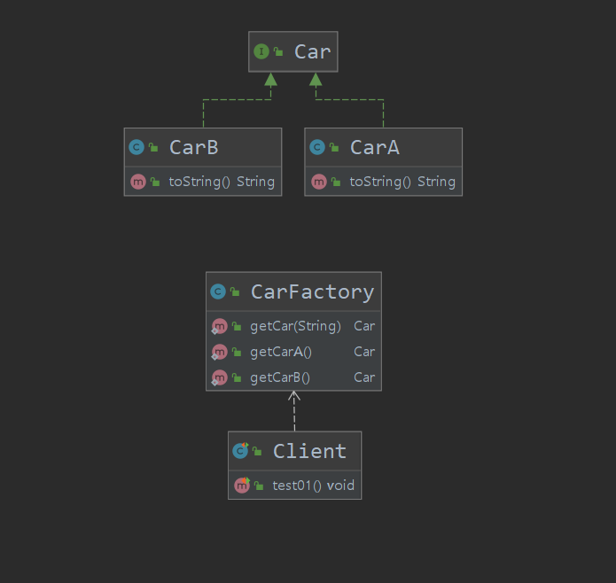
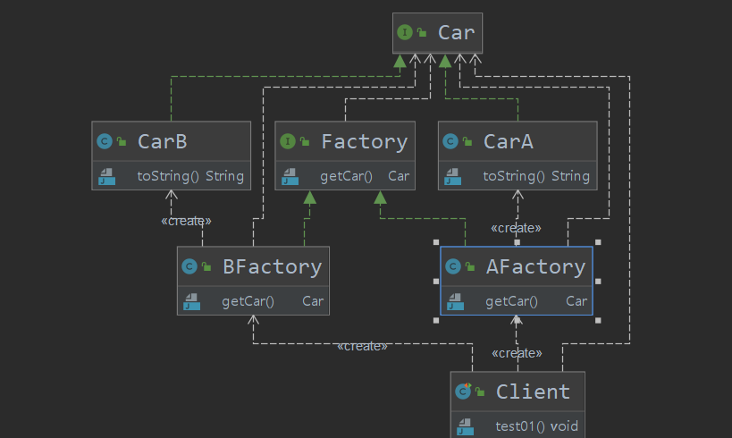
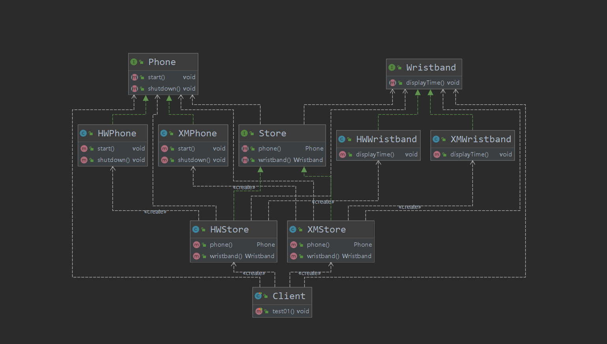
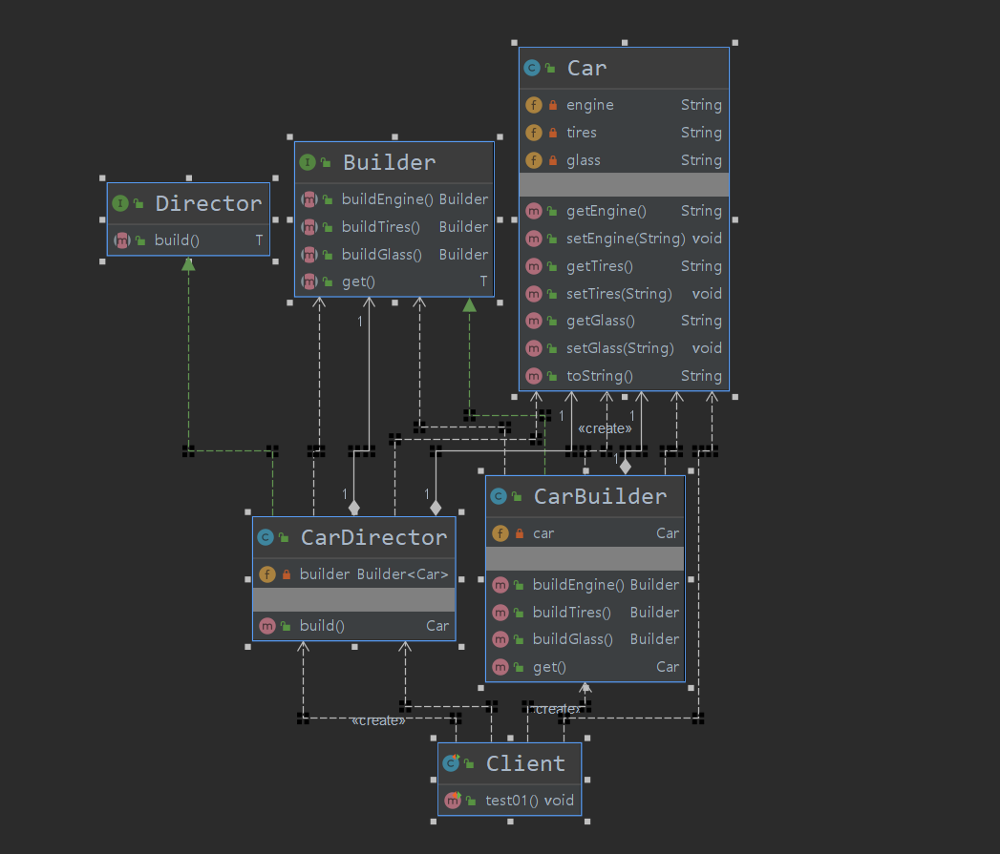
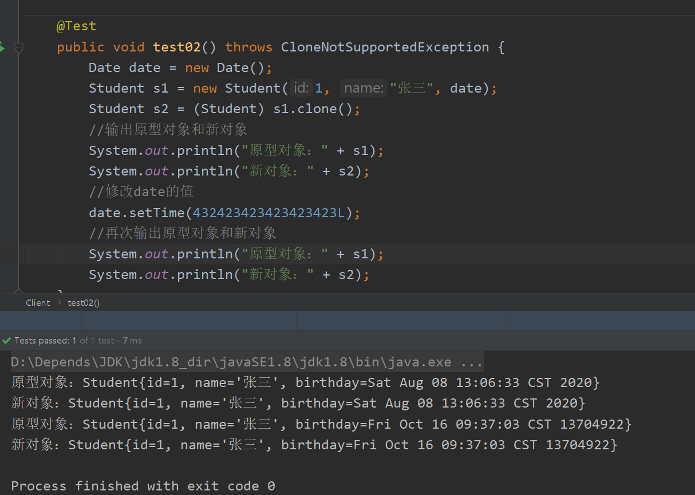
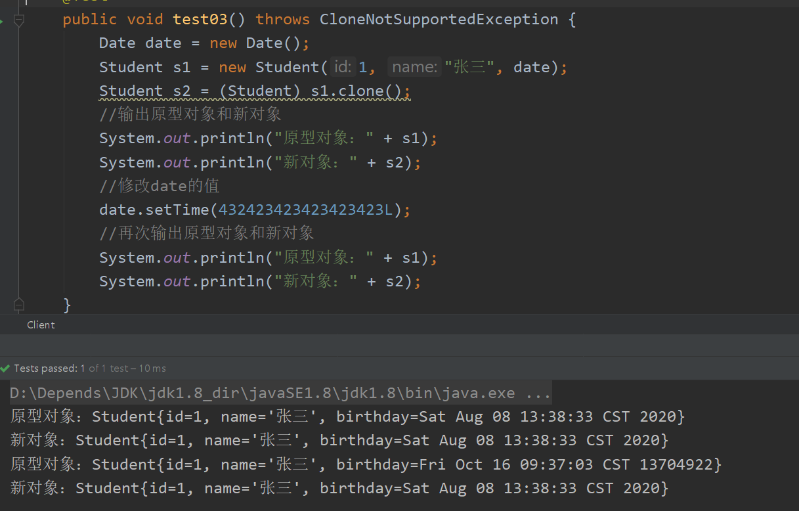
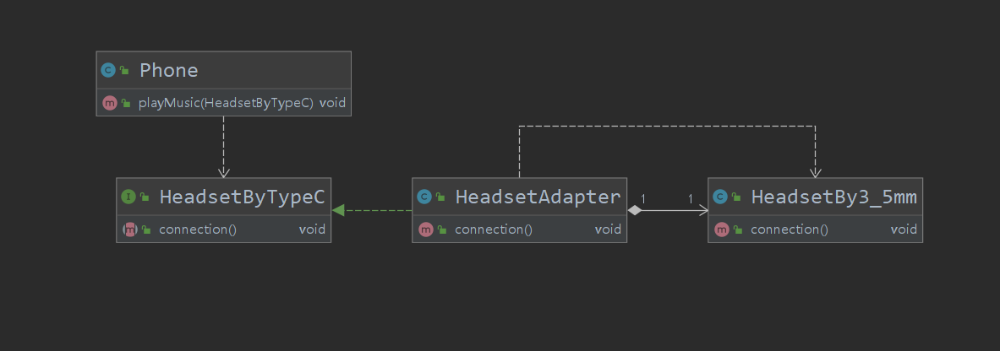
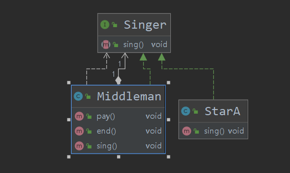
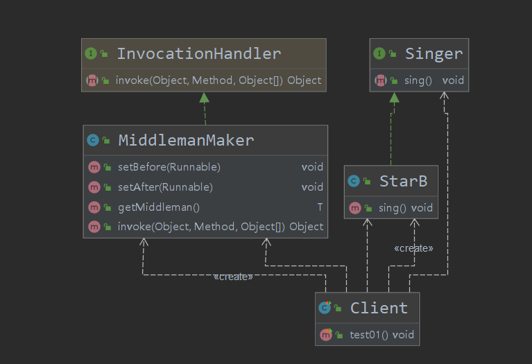
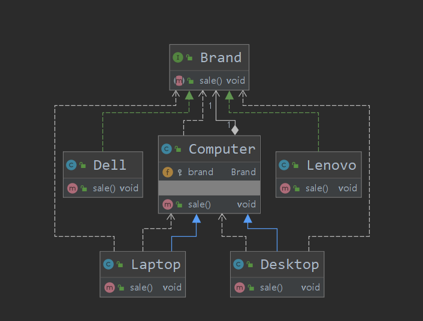

# 设计模式

## OOP七大原则

**1、开闭原则（Open Close Principle）**

开闭原则的意思是：**对扩展开放，对修改关闭**。在程序需要进行拓展的时候，不能去修改原有的代码，实现一个热插拔的效果。简言之，是为了使程序的扩展性好，易于维护和升级。想要达到这样的效果，我们需要使用接口和抽象类，后面的具体设计中我们会提到这点。

**2、里氏代换原则（Liskov Substitution Principle）**

里氏代换原则是面向对象设计的基本原则之一。 里氏代换原则中说，任何基类可以出现的地方，子类一定可以出现。LSP 是继承复用的基石，只有当派生类可以替换掉基类，且软件单位的功能不受到影响时，基类才能真正被复用，而派生类也能够在基类的基础上增加新的行为。里氏代换原则是对开闭原则的补充。实现开闭原则的关键步骤就是抽象化，而基类与子类的继承关系就是抽象化的具体实现，所以里氏代换原则是对实现抽象化的具体步骤的规范。

**3、依赖倒转原则（Dependence Inversion Principle）**

这个原则是开闭原则的基础，具体内容：针对接口编程，依赖于抽象而不依赖于具体。

**4、接口隔离原则（Interface Segregation Principle）**

这个原则的意思是：使用多个隔离的接口，比使用单个接口要好。它还有另外一个意思是：降低类之间的耦合度。由此可见，其实设计模式就是从大型软件架构出发、便于升级和维护的软件设计思想，它强调降低依赖，降低耦合。

**5、迪米特法则，又称最少知道原则（Demeter Principle）**

最少知道原则是指：一个实体应当尽量少地与其他实体之间发生相互作用，使得系统功能模块相对独立。

**6、合成复用原则（Composite Reuse Principle）**

合成复用原则是指：尽量使用合成/聚合的方式，而不是使用继承。
1. **开闭原则**：对扩展开放，对修改关闭
2. **里氏提盒原则**：继承必须确保父类所拥有的性质在子类中仍然成立
3. **依赖倒置原则**：要面向接口编程，不要面向实现编程
4. **单一职责原则**：控制类的粒度大小，将对象解耦，提高其内聚性
5. **接口隔离原则**：要为各个类建立它们需要的专用接口
6. **迪米特法则**：直接与你的朋友交谈，不跟“陌生人”说话
7. **合成服用原则**：尽量先使用组合或聚合等关联关系来实现，其次才考虑使用继承关系来实现

## 创建型模式

### 单例模式

* 饿汉式
  * 缺点：可以被反射破解
  * 类加载时就创建的该对象的实例，因为类的静态初始化是线程安全的，该方式适用于多线程环境下，因为该对象是在类的初始化时创建的，如果该类创建的过程中需要需要耗费大量资源，则会造成性能的下降

```java
public class HungryMan {
    private static HungryMan hungryMan = new HungryMan();
    //构造器私有化
    private HungryMan(){
        // 判断当前实例是否为空
        // 避免使用反射破解
        if (hungryMan != null){
            throw new RuntimeException("could not creat this class in constructor");
        }
    }
	//获取当前实例的方法
    public static HungryMan getInstance(){
        return hungryMan;
    }class
}
```

* 懒汉式
  * 缺点：可以被反射破解、线程不安全

```java
public class LazyMan {
    private static LazyMan lazyMan;
	//构造器私有化
    private LazyMan(){
        
    }
	//获取该对象实例的方法
    public static LazyMan getInstance(){
        if (lazyMan == null){
            lazyMan = new LazyMan();
        }
        return lazyMan;
    }
}
```

* 双重检测锁（DCL懒汉式）
  * 缺点：可以被反射破解、可能会发生指令重排，需要在实例属性前加volatile修饰

```java
public class LazyMan {
    		/*加volatile避免系统发生指令重排*/
    private static volatile LazyMan lazyMan;

    private LazyMan(){
    }

    public static LazyMan getInstance(){
        if (lazyMan == null) {
            synchronized(LazyMan.class) {
                if (lazyMan == null) {
                    lazyMan = new LazyMan();
                }
            }
        }
        return lazyMan;
    }
}
```

* 静态内部类
  * 缺点：可以被反射破解

```java
public class InnerSingle {

    private InnerSingle(){

    }

    private static InnerSingle getInstance(){
        return Inner.innerSingle;
    }
    private static class Inner{
        private static InnerSingle innerSingle = new InnerSingle();
    }
}
```

* 枚举
  * 缺点：没有类的功能，不能继承
  * 不能被反射破解，枚举其实是一个类，里面没有无参构造，有一个有参构造，参数为一个String，一个int

```java
public enum EnumSingle {
    INSTANCE;
}
```

### 工厂模式

* **实现了创建者和调用者的分离**

* **本质**

  * 实例化对象不适用new，用工厂方法代替
  * 将选择实现类，创建对象同意管理和控制，从而将调用者跟我们的实现类解耦

* **三种模式**

  * **简单工厂模式**

    * 用来生产同意等级结构中的任意产品（对于新加的产品需要修改已有的代码）
    * 方式一：使用同一个方法根据需要产品的名字返回该产品

    ```java
    //产品接口
    public interface Car {
    }
    
    public class CarA implements Car {
        @Override
        public String toString() {
            return "this is car a";
        }
    }
    public class CarB implements Car {
        @Override
        public String toString() {
            return "this is car b";
        }
    }
    public class CarFactory {
        public static Car getCar(String carName){
            switch (carName){
                case "a":
                    return new CarA();
                case "b":
                    return new CarB();
                default:
                    return null;
            }
        }
    }
    ```

    * 方式二：使用不同的方法，需要那个产品就调用那个方法

    ```java
    public class CarFactory {
        public static Car getCarA(){
            return new CarA();
        }
        public static Car getCarB(){
            return new CarB();
        }
    }
    ```

    *  缺点：没有完全实现OCP原则，对程序进行扩展时需要修改已有的代码。

    

    ---

    

  * **工厂方法模式**

    * 用来生产同一等级结构中的固定产品（支持增加任意产品）

    ```java
    //工厂接口
    public interface Factory {
        Car getCar();
    }
    //产品接口
    public interface Car {
    }
    
    public class CarA implements Car {
        @Override
        public String toString() {
            return "this is car a";
        }
    }
    public class CarB implements Car {
        @Override
        public String toString() {
            return "this is car b";
        }
    }
    public class AFactory implements Factory {
        @Override
        public Car getCar() {
            return new CarA();
        }
    }
    public class BFactory implements Factory {
        @Override
        public Car getCar() {
            return new CarB();
        }
    }
    
    ```

    * 缺点：有着很高的结构复杂度、代码复杂度、编程复杂度、管理上的复杂度

  * 根据设计原则：工厂方法模式

  * 根据实际业务：简单工厂模式

  

### 抽象工厂模式

* 围绕一个超级工厂创建其他工厂，该超级工厂有称为其他工厂的工厂
* 定义：抽象工厂提供了一个创建一系列相关或者相互依赖的对象和接口，无需指定他们的具体的类
* 适用场景：
  * 客户端（应用层）不依赖于产品类实例如何呗创建、实现等细节
  * 强调一系列相关产品对象（属于同一产品族）一起使用创建对象需要大量的重复代码
  * 提供一个产品类的库，所有的产品以同样的接口出现，从而使得客户端不依赖与具体的实现

```java
//抽象工厂
public interface Factory {
    Phone phone();
    Wristband wristband();
}
//Phone产品族
public interface Phone {
    void start();
    void shutdown();
}
//Wristband产品族
public interface Wristband {
    void displayTime();
}
//Phone产品族的具体产品
public class XMPhone implements Phone {
    @Override
    public void start() {
        System.out.println("小米手机开机！");
    }
    @Override
    public void shutdown() {
        System.out.println("小米手机关机！");
    }
}
//Phone产品族的具体产品
public class HWPhone implements Phone {
    @Override
    public void start() {
        System.out.println("华为手机开机！");
    }
    @Override
    public void shutdown() {
        System.out.println("华为手机关机！");
    }
}
//Wristband产品族的具体产品
public class XMWristband implements Wristband {
    @Override
    public void displayTime() {
        System.out.println("小爱同学："+ System.currentTimeMillis());
    }
}
//Wristband产品族的具体产品
public class HWWristband implements Wristband {
    @Override
    public void displayTime() {
        System.out.println("小艺："+ System.currentTimeMillis());
    }
}
//XM具体工厂
public class XMFactory implements Factory {
    @Override
    public Phone phone() {
        return new XMPhone();
    }
    @Override
    public Wristband wristband() {
        return new XMWristband();
    }
}
//HW具体工厂
public class HWFactory implements Factory {
    @Override
    public Phone phone() {
        return new HWPhone();
    }
    @Override
    public Wristband wristband() {
        return new HWWristband();
    }
}
```




* 优点：
  * 具体产品在应用层的代码隔离，无需关心创建细节
  * 将一个系列的产品统一到一起创建
* 缺点：
  * 规定了所有可能被创建的产品集合，产品族中扩展新产品困难
  * 增加了系统的抽象性和理解难度

### 建造者模式

* 建造者模式属于创建型模式，它提供了一种创建对象的最佳方式
* 定义：将一个对象的结构与它的表示分离，使得同样的构建过程可以创建不同的表示
* 主要作用：在用户不知道对象的建造过程和细节的情况下就可以直接创建复杂的对象
* 用户只需要给出指定复杂对象的类型和内容，创造者模式负责按顺序创建复杂对象（把内部的建造过程和细节隐藏起来）
* 例子：
  * 工厂（建造者模式）：负责制造汽车（组装过程和细节在工厂内）
  * 汽车购买者（用户）：你需要说出你需要的型号（对象的类型和内容），然后直接购买就可以使用了（不需要知道汽车是怎么组装的（车轮、车门、发动机、方向盘……））

```java
//产品
public class Car {
    private String engine;
    private String tires;
    private String glass;
    public String getEngine() {
        return engine;
    }
    public void setEngine(String engine) {
        this.engine = engine;
    }
    public String getTires() {
        return tires;
    }
    public void setTires(String tires) {
        this.tires = tires;
    }
    public String getGlass() {
        return glass;
    }
    public void setGlass(String glass) {
        this.glass = glass;
    }
    @Override
    public String toString() {
        return "Car{" +
            "engine='" + engine + '\'' +
            ", tires='" + tires + '\'' +
            ", glass='" + glass + '\'' +
            '}';
    }
}
//抽象建造者
public interface Builder<T> {
    Builder buildEngine();
    Builder buildTires();
    Builder buildGlass();
    T get();
}
//抽象组装者
public interface Director<T> {
    T build();
}
//具体建造者
public class CarBuilder implements Builder<Car> {
    private Car car;
    public CarBuilder() {
        this.car = new Car();
    }
    @Override
    public Builder buildEngine() {
        car.setEngine("A牌引擎");
        return this;
    }
    @Override
    public Builder buildTires() {
        car.setTires("B牌轮胎");
        return this;
    }
    @Override
    public Builder buildGlass() {
        car.setGlass("C牌玻璃");
        return this;
    }
    public Car get(){
        return this.car;
    }
}
//具体组装者
public class CarDirector implements Director<Car> {
    private Builder<Car> builder;
    public CarDirector(Builder<Car> builder) {
        this.builder = builder;
    }
    @Override
    public Car build() {
        builder.buildEngine().buildGlass().buildTires();
        return builder.get();
    }
}
```



* 优点：
  * 产品建造和表示分离，实现类解耦，使用建造者模式可以是客户端不必知道产品内部的组成和细节
  * 将复杂的产品的创建步骤分解在不同的方法中，使得创建过程更加清晰
  * 具体的建造者类之间是相互独立的，这有利于系统的扩展，增加新的具体建造者无需修改原有的类库的代码，符合“开闭原则”
* 缺点：
  * 建造者模式所创建的产品一般具有较多的共同点，其组成部分相似，如果产品之间的差异性很大，则不适合使用建造者模式，因此器十三亿范围受到一的限制
    * 如果产品内部变化复杂，可能会导致需要定义很多具体的建造者来实现这种变化，导致系统变得很庞大

### 原型模式

* 通过new产生一个对象需要非常繁琐的数据准备或访问权限，则可以使用原型模式

* 就是java里的克隆技术，以某个对象为原型，复制出新的对象，显然，新的对象举要元对象的特点

* 优势：效率高（直接克隆，避免了重新执行构造过程步骤）

* 克隆类似new，但不同于new，new创建新的对象属性采用的是默认值，克隆出的对象的属性值完全可原型对象相同，并且克隆出的新对象改变不会影响原型对象，然后再修改原型对象的值

* 原型模式的实现：

  * Cloneable接口和clone方法
  * Prototyoe模式中实现起来最困难的地方就是内存的复制操作，所幸在java中提供了clone（）方法替我们做了绝大部分的事情 

* 浅克隆

  ```java
  //对象
  public class Student implements Cloneable{
      private int id;
      private String name;
  
      public Student(int id, String name) {
          this.id = id;
          this.name = name;
      }
  
      @Override
      protected Object clone() throws CloneNotSupportedException {
          return super.clone();
      }
  }
  //测试类
  public class Client {
      @Test
      public void test01() throws CloneNotSupportedException {
          Student s1  = new Student(1, "张三");
          System.out.println(s1);
          Student s2 = (Student) s1.clone();
          System.out.println(s2);
      }
  }
  ```

  * 问题：当原型对象属性有引用类型时，只会将该引用类型的属性的指针克隆过去，设说明原型对象和新对象的那个引用类型属性都指向了同一个对象，一旦那个对象里面的值发生改变时，原型对象和新对象都会受到影响

  

* 深克隆

  * 将原型对象里面的引用类型的属性在clone方法里也进行克隆

  ```java
  @Override
  protected Object clone() throws CloneNotSupportedException {
      Student clone = (Student) super.clone();
      clone.birthday = (Date) this.birthday.clone();
      return clone;
  }
  ```

  

* 深克隆（序列化反序列化实现）

  * **注意：**该类必须要实现Serializable接口

  ```java
  //直接实现
  ByteArrayOutputStream bos = new ByteArrayOutputStream();
  ObjectOutputStream oos = new ObjectOutputStream(bos);
  oos.writeObject(s1);
  oos.flush();
  ByteArrayInputStream bis = new ByteArrayInputStream(bos.toByteArray());
  ObjectInputStream ois = new ObjectInputStream(bis);
  Student s2 = (Student) ois.readObject();
  //或者在对象里面加方法实现
  public Student deepClone(){
      ObjectOutputStream oos = null;
      ObjectInputStream ois = null;
      ByteArrayOutputStream bos = null;
      try {
          bos = new ByteArrayOutputStream();
          oos = new ObjectOutputStream(bos);
          oos.writeObject(this);
          oos.flush();
          ois = new ObjectInputStream(new ByteArrayInputStream(bos.toByteArray()));
          return (Student) ois.readObject();
      }catch (Exception e){
          e.printStackTrace();
          return null;
      }finally {
          release(bos, oos, ois);
      }
  }
  ```

  

## 结构型模式

**作用：**从程序的结构上实现松耦合，从而可以扩大整体的类结构，用来解决更大的问题

### 适配器模式

* 将一个类的接口转换成客户希望的另一个接口，Adapter模式使得原本由于接口不兼容而不能一起工作的那些类可以在一起工作

* 模式中的角色

  * 目标接口（Target）：客户所期待的接口，目标可以是具体的或抽象的类，也可以是接口
  * 需要适配的类（Adaptee）：需要适配的类或适配者类
  * 适配器（Adapter）：通过包装一个需要适配的对象，把原接口转换成目标接口

  ```java
  //相当于客户
  public class Phone {
      //播放音乐需要type-c接口的耳机
      public void playMusic(HeadsetByTypeC headsetByType_c){
          headsetByType_c.connection();
          System.out.println("播放音乐");
      }
  }
  //type-c接口的耳机（相当于目标接口target）
  public interface HeadsetByTypeC {
      void connection();
  }
  //3.5毫米接口转type-c接口（相当于适配器adapter）
  public class HeadsetAdapter implements HeadsetByTypeC {
      private HeadsetBy3_5mm headsetBy35mm;
      //需要一个耳机对象
      public HeadsetAdapter(HeadsetBy3_5mm headsetBy35mm) {
          this.headsetBy35mm = headsetBy35mm;
      }
      //该方法实现适配需要的操作
      @Override
      public void connection() {
          headsetBy35mm.connection();
      }
  }
  //3.5毫米类型的耳机（相当与被适配的类adaptee）
  public class HeadsetBy3_5mm {
      public void connection(){
          System.out.println("连接成功！");
      }
  }
  ```

  

### 代理模式

* 作用：
  * 通过代理，控制对象的访问
  * 可以详细控制访问某个（某类）对象的方法，在调用这个方法前做前置操作，调用这个方法后做后置操作（即：AOP的微观实现）
* AOP（Aspect Oriented Programming面向切面编程）的核心实现机制
* 角色：
  * 抽象角色：定义代理角色和真实角色的公共对外方法
* 真实角色：
  * 实现抽象角色，定义真实角色所需要实现的业务逻辑供代理类角色调用
  * 关注真正的业务逻辑
* 代理角色
  * 实现抽象角色，是真实角色的代理，通过真实角色的业务逻辑方法来实现抽象的方法，可以附加自己的操作
  * 将同统一流程控制放到代理角色中处理
* 静态代理

```java
//抽象角色
public interface Singer {
    void sing();
}
//真实角色
public class StarA implements Singer {

    private String name;

    public StarA(String name) {
        this.name = name;
    }

    @Override
    public void sing() {
        System.out.println("歌手"+name +"在唱歌！");
    }
}
//代理角色
public class Middleman implements Singer{
    private String name;
    private Singer singer;
    public void pay(){
        System.out.println("中介"+name +"收钱");
    }
    public void end(){
        System.out.println("中介"+name +"收尾");
    }
    @Override
    public void sing() {
        pay();
        singer.sing();
        end();
    }
    public Middleman(String name, Singer singer) {
        this.name = name;
        this.singer = singer;
    }
}
```



* 动态代理
  * JDK自带的动态代理
    * java.lang.reflect.Proxy
      * 作用：动态生成代理类和对象
    * java.lang.reflect.InvocationHandler(处理器接口)
      * 可以通过invkoe方法实现对真实角色的代理访问
      * 每次通过Proxy生成代理类对象d时都要指定对应的处理器对象

```java
//抽象角色
public interface Singer {
    void sing();
}
//真实角色
public class StarA implements Singer {

    private String name;

    public StarA(String name) {
        this.name = name;
    }

    @Override
    public void sing() {
        System.out.println("歌手"+name +"在唱歌！");
    }
}
//获取代理角色的对象
public class MiddlemanMaker<T> implements InvocationHandler {
    private Object target;
    //前置事件
    private Runnable before;
    //后置事件
    private Runnable after;
    public void setBefore(Runnable before) {
        this.before = before;
    }
    public void setAfter(Runnable after) {
        this.after = after;
    }
    public MiddlemanMaker(Object target) {
        this.target = target;
    }
    public T getMiddleman(){
        return (T)Proxy.newProxyInstance(target.getClass().getClassLoader(),
                target.getClass().getInterfaces(),
                this);
    }
    @Override
    public Object invoke(Object proxy, Method method, Object[] args) throws Throwable {
        if (before != null){
            before.run();
        }
        Object result = method.invoke(target, args);
        if (after != null){
            after.run();
        }
        return result;
    }
}
```



* AOP（Aspect Oriented Programming面向切面编程）
  * 它是可以通过预编译方式和运行期动态代理实现在不修改源代码的情况下给程序动态统一添加功能的一种技术，它是一种新的方法论，它是的对传统OOP编程的一种补充

### 桥接模式

* 处理多重继承结构，处理多维度变化的场景，将各个维度设计成独立的继承结构，使得各个维度可以独立的扩展在抽象层建立关联

```java
//品牌维度
public interface Brand {
    void sale();
}
//电脑维度
public class Computer {
    protected Brand brand;
    public Computer(Brand brand) {
        this.brand = brand;
    }
    public void sale(){
        brand.sale();
    }
}
//台式电脑
public class Desktop extends Computer {
    public Desktop(Brand brand) {
        super(brand);
    }
    @Override
    public void sale() {
        super.sale();
        System.out.println("台式机");
    }
}
//笔记本电脑
public class Laptop extends Computer {
    public Laptop(Brand brand) {
        super(brand);
    }
    @Override
    public void sale() {
        super.sale();
        System.out.println("笔记本");
    }
}
//联想品牌
public class Lenovo implements Brand {
    @Override
    public void sale() {
        System.out.print("销售联想");
    }
}
//戴尔品牌
public class Dell implements Brand {
    @Override
    public void sale() {
        System.out.print("销售戴尔");
    }
}
```



* 桥接模式可以取代多层继承的方案，多层继承违背了单一职责原则，复用性较差，类的个数也非常多，桥接模式可以极大的减少子类的个数，从而降低管理和维护的成本
* 桥接模式极大的提高了系统可扩展性，在两个变化维度中任意扩展一个维度，都不需要修改原有的系统，符合开闭原则

### 组合模式

* 把部分和整体的关系用树形结构来表示，从而是客户端可以使用统一的方式处理部分对象和整体对象
* 核心：
  * 抽象构件（Component）角色：定义了叶子和容器构件的共同点
  * 叶子（Leaf）构建角色：无子节点
  * 容器（Composite）构建角色：有容器特征，可以包含子节点 

## 行为型模式


