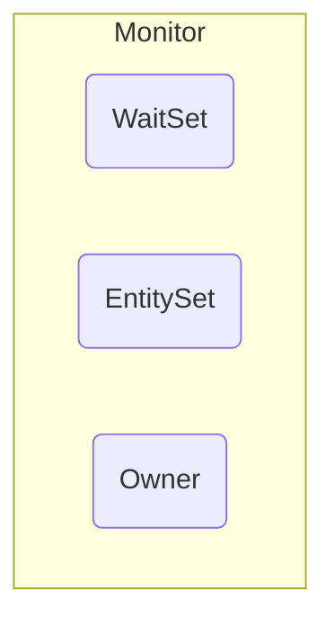
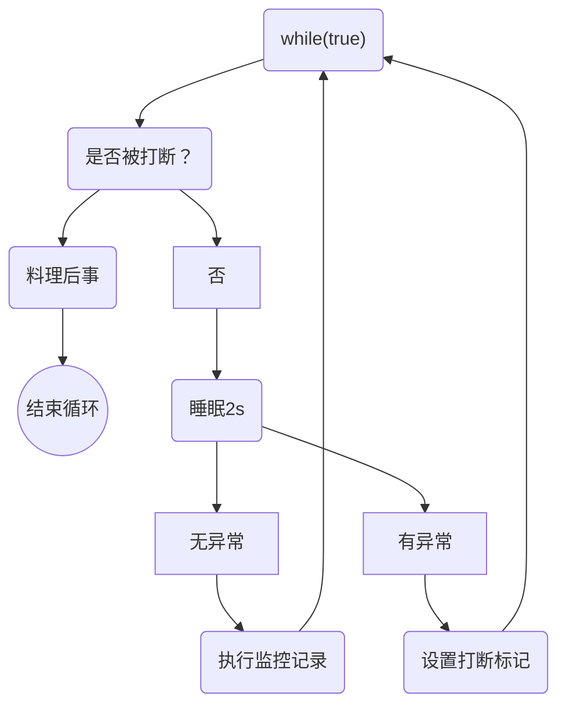

# 并发

## 共享模型

### 共享问题

* **临界区**
  一段代码块内会对一个资源进行读写操作，会有多个线程执行这段代码块，这段代码块就叫临界区
* **竞态条件**
  多个线程在临界区内执行，由于代码的执行序列不同而导致结果无法预测，称之为发生了竞态条件

### synchronized

* 锁升级原理

* 无锁到偏向锁
  * 对象的markword倒数第三位为1的话则可以使用偏向锁，否则竞争时直接升级为轻量级锁。
  * 无锁到偏向锁的过程：
    * 一个线程需要加锁时会将线程的id写入锁对象的markword头上面，

### 线程安全分析

### Monitor

使用synchronized(obj) 锁定一个对象时将这个对象和操作系统提供的monitor对象关联，

一个monitor对象包含这几个属性，

* entitySet
  * 当一个线程获取对象锁时如果owner已经指向一个线程则进入这个队列等待
* Owner
  * 当一个对象获取该对象锁时，如果owner没有指向任何线程，则owner指向这个线程，代表这个对象锁被该线程拥有

当对象锁和monitor关联后，这个对象的markword位置则会存放指向monitor的指针，而markword里面的相关属性会被存放到monitor对象内

### wait/notify

### 现车状态转换

### 活跃性

### Lock

# 其他

## synchronized

###### 保证被包裹的代码块的原子性

* 底层实现（大致）：
  * JDK早期直接就是重量级锁（向操作系统申请锁）
  * 后来改进为锁升级的过程
    * 偏向锁：当一段加锁了的代码第一次被一个线程访问时，会在这个锁上标记这个线程的id号，下次如果还是这个线程访问就直接通行，没有进行其他操作，提高了效率。
    * 自旋锁：接着上面的过程，如果有多个线程访问时，当一个线程持有这个锁未释放时，其他线程就会在外面执行自选操作，类似while循环。
    * 重量级锁：当自旋次数达到10此后就会向操作系统申请重量级锁。
  * 理解：偏向锁和自旋锁都是用户态的操作效率会提高，重量级锁是用户态内核态频繁切换，降低了效率，但是自旋锁也有缺点，就是如果当自旋的线程多了起来也会降低效率，因为自旋操作时这个线程没有被挂起，当自旋的线程多了之后就会有一大堆线程在执行自旋操作，而操作算是一种无意义的操作，所以当一段加锁的代码执行时间很长而且会有很多个线程访问时不建议使用自旋锁
* 在synchronized代码块内出异常默认锁会被释放
* synchronized不能锁字符串常量和基础的数值包装类型
  * 字符串常量在字符串常量池内始终是一个对象
  * 数组包装类型由于内部结构跟改一下就会变成不同的对象

## volatile

###### 保证被修饰的对象不被指令重排

* 保证线程的可见性
  * jvm虚拟机分为heap、stack等空间，heap空间是共享的而开启线程就是创建一个stack，这两个线程在不同的stack里面访问heap里面的同一个数据时都需要copy一份数据到自己stack空间里面的数据存储区域内，再在自己的区域内对这个数据进行修改，修改完才写回到heap空间，而另一个线程也需要获取这个数据，而不知道这个数据被没被修改，所以需要保证线程的可见性这里需要使用到cpu的缓存一直循协议。
* 禁止指令重排
  * 编译器会将程序编译完的指令进行重写排序以提高效率。
  * 我自己的理解：在一段代码内上半部分的代码执行耗时上，下半部分的代码执行耗时端，而这两部分代码执行时也没有太多关联，编译器就会将下半部分的代码编译完的指令安排到上半部分代码前面执行。
  * 在单例模式的双重检测锁实现方式下也需要使用volatile关键字修饰实例对象
    * 因为jvm在创建对象时会分为三步：申请空间、初始化成员变量、赋值到实例，在这几个部分内：
      * 如果第一个线程在锁内初始化这个对象，初始化时发生了指令重排，把第二和第三个步骤换了一下，那么第二个线程就会拿到一个默认值全部为空的对象。

## 两阶段终止模式

### 

