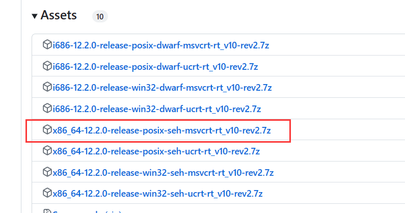

# 批处理脚本\常用命令

* 软连接
  * 参考[Win10 mklink 命令怎么用，mklink 命令使用教程](https://www.icoa.cn/a/910.html)
  * 以管理员方式启动cmd
  * `mklink 目标文件 原始文件`

* 多行命令换行输入加^

  ```bash
  echo 123^
  456^
  789^
  # 输出
  123456789
  ```

* 睡眠：`timeout 秒数	`

* 修改当前编码为UTF-8：`chcp 65001`

# 常用操作

## windwos安装gcc

* 下载MinGW压缩包：[github下载地址](https://github.com/niXman/mingw-builds-binaries/releases)

* 根据不同电脑选择不同版本，我这里选择64位,

  

* 下载后解压到需要安装的目录

* 配置环境变量，将解压后的目录下的bin目录配置环境变量

* 配置后重启终端，输入`gcc -v` 查看版本

* 参考：
  * [MinGW-w64 C/C++编译器各版本说明](https://blog.csdn.net/weixin_42880082/article/details/120097989)
  * [MinGW离线安装包安装教程](https://blog.csdn.net/m0_52733659/article/details/121527947)
  * [windows下安装gcc12（mingw-w64）](https://zhuanlan.zhihu.com/p/565370467)

## windows开启启动文件夹

`C:\ProgramData\Microsoft\Windows\Start Menu\Programs\Startup`

## windows 命令行工具操作linux

* ssh，远程连接 和linux下的ssh使用方式一样
* scp，远程传输文件，和linux下的scp一样

* 使用scoop作为windwos 的包管理
  * 安装

```bash
Set-ExecutionPolicy -ExecutionPolicy RemoteSigned -Scope CurrentUser
Invoke-Expression (New-Object System.Net.WebClient).DownloadString('https://get.scoop.sh')
```

# bat 脚本

* 字符串操作
  * [字符串包含操作](https://blog.csdn.net/tjcwt2011/article/details/120508290)
  * [字符串操作](https://blog.csdn.net/peng_cao/article/details/74170979)
* 函数定义
  * [函数定义]()
* for命令
  * [for命令](https://blog.csdn.net/weixin_43165135/article/details/127702841)


# 注册表相关操作

## caps lock键禁用

1. 打开注册表编辑器
2. 进入`HKEY_LOCAL_MACHINE\SYSTEM\CurrentControlSet\Control\Keyboard Layout`
3. **右键点击** 在空白处，单击 **New** 然后点击 **Binary Value**(二进制值). 将新的二进制值命名为 **ScanCode Map**.
4. 设置值为`00 00 00 00 00 00 00 00 02 00 00 00 00 00 3A 00 00 00 00 00`
5. 保存后重启电脑

## 自定义右键菜单

1. 添加选中文件夹时的右键菜单
   1. 打开注册表
   2. 进入`\HKEY_LOCAL_MACHINE\SOFTWARE\Classes\Directory\shell`路径
   3. 新建项，
   4. 设置默认名称的值为右键显示的字符串
   5. 新建icon字符串，值设置为使用软件的路径
   6. 新建项command
   7. 设置默认值为 `软件的路径 "%1"`,其中%1为选中文件夹的路径
2. 添加点击文件夹空白处的右键菜单
   1. 进入`\HKEY_LOCAL_MACHINE\SOFTWARE\Classes\Directory\background\shell`路径
   2. 其它步骤和添加选中文件夹时的右键菜单一样，第7步时将`%1`改为`%v.`，同样表示当前文件夹的路径
3. 添加选择文件时的右键菜单
   1. 进入`\HKEY_LOCAL_MACHINE\SOFTWARE\Classes`路径
   2. 路径下第一个项`*`代表所有类型的文件，其它已`.`开头的项是某个具体类型的文件，根据具体情况在这个项下面的shell项内添加就可以了
   3. 其它步骤和添加选中文件夹时的右键菜单一样

## windows11

* 还原右键菜单
  * 命令行输入以下命令
  * `reg.exe add 'HKCU\Software\Classes\CLSID\{86ca1aa0-34aa-4e8b-a509-50c905bae2a2}\InprocServer32' /f /ve`
  * 打开任务管理器，选择windows资源管理器，点击重启任务按钮
*  禁用蓝牙绝对音量
  * 打开注册表
  * 找到以下路径
    * `计算机\HKEY_LOCAL_MACHINE\SYSTEM\ControlSet001\Control\Bluetooth\Audio\AVRCP\CT`
  * 找到`DisableAbsoluteVolume`变量，将里面的值修改为1
