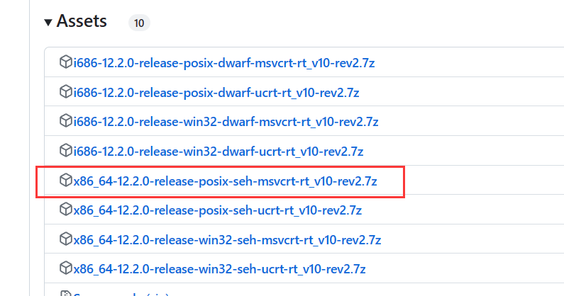

# 批处理脚本\常用命令

* 软连接
  * 参考[Win10 mklink 命令怎么用，mklink 命令使用教程](https://www.icoa.cn/a/910.html)
  * 以管理员方式启动cmd
  * `mklink 目标文件 原始文件`

* 多行命令换行输入加^

  ```bash
  echo 123^
  456^
  789^
  # 输出
  123456789
  ```

* 睡眠：`timeout 秒数	`

* 修改当前编码为UTF-8：`chcp 65001`

# 常用操作

## windwos安装gcc

* 下载MinGW压缩包：[github下载地址](https://github.com/niXman/mingw-builds-binaries/releases)

* 根据不同电脑选择不同版本，我这里选择64位,

  

* 下载后解压到需要安装的目录

* 配置环境变量，将解压后的目录下的bin目录配置环境变量

* 配置后重启终端，输入`gcc -v` 查看版本

* 参考：
  * [MinGW-w64 C/C++编译器各版本说明](https://blog.csdn.net/weixin_42880082/article/details/120097989)
  * [MinGW离线安装包安装教程](https://blog.csdn.net/m0_52733659/article/details/121527947)
  * [windows下安装gcc12（mingw-w64）](https://zhuanlan.zhihu.com/p/565370467)

## windows开启启动文件夹

`C:\ProgramData\Microsoft\Windows\Start Menu\Programs\Startup`

## windows 命令行工具操作linux

* ssh，远程连接 和linux下的ssh使用方式一样
* scp，远程传输文件，和linux下的scp一样

* 使用scoop作为windwos 的包管理
  * 安装

```bash
Set-ExecutionPolicy -ExecutionPolicy RemoteSigned -Scope CurrentUser
Invoke-Expression (New-Object System.Net.WebClient).DownloadString('https://get.scoop.sh')
```

# bat 脚本

* 字符串操作
  * [字符串包含操作](https://blog.csdn.net/tjcwt2011/article/details/120508290)
  * [字符串操作](https://blog.csdn.net/peng_cao/article/details/74170979)
* 函数定义
  * [函数定义]()
* for命令
  * [for命令](https://blog.csdn.net/weixin_43165135/article/details/127702841)